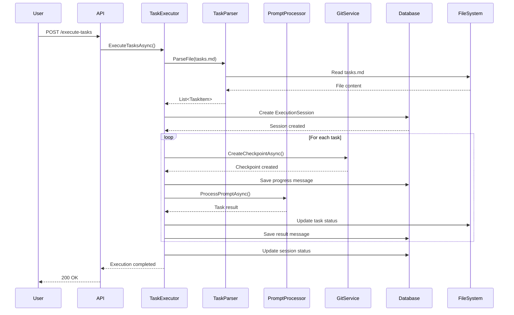

# Документ проектирования: Agent Task Executor

## Обзор

Agent Task Executor - это система для автоматического выполнения задач из файла tasks.md в агентском режиме. Система интегрируется с существующим PromptProcessor для выполнения задач через LLM, создает Git чекпоинты перед каждой задачей и отслеживает прогресс выполнения.

Ключевые возможности:
- Парсинг файлов tasks.md с поддержкой иерархических задач
- Последовательное выполнение незавершенных задач через PromptProcessor
- Автоматическое создание Git чекпоинтов перед каждой задачей
- Отслеживание прогресса и сохранение состояния выполнения
- Управление выполнением (остановка/продолжение)
- Обновление статуса задач в файле tasks.md

## Архитектура

### Компоненты высокого уровня

```
┌─────────────────┐
│   API Layer     │  POST /api/dialogues/{id}/execute-tasks
│   (Program.cs)  │  POST /api/dialogues/{id}/stop-execution
└────────┬────────┘  GET  /api/dialogues/{id}/execution-status
         │
         ▼
┌─────────────────────────────────────────────────────────┐
│           TaskExecutorService                           │
│  - ExecuteTasksAsync()                                  │
│  - StopExecutionAsync()                                 │
│  - ResumeExecutionAsync()                               │
│  - GetExecutionStatusAsync()                            │
└───┬─────────────────────────────────────────────────┬───┘
    │                                                 │
    ▼                                                 ▼
┌──────────────────┐                        ┌─────────────────┐
│  TaskParser      │                        │ TaskFileUpdater │
│  - ParseFile()   │                        │ - UpdateStatus()│
│  - ExtractTasks()│                        │ - CreateBackup()│
└──────────────────┘                        └─────────────────┘
    │
    ▼
┌─────────────────────────────────────────────────────────┐
│              Existing Services                          │
│  - IPromptProcessor (выполнение задач)                  │
│  - IGitService (создание чекпоинтов)                    │
│  - RefactoringDbContext (сохранение состояния)          │
└─────────────────────────────────────────────────────────┘
```

### Поток выполнения



## Компоненты и интерфейсы

### 1. ITaskExecutorService

Основной интерфейс для управления выполнением задач.

```csharp
namespace CSharpRefactoringAssistant.Services;

public interface ITaskExecutorService
{
    /// <summary>
    /// Запускает выполнение задач из файла tasks.md
    /// </summary>
    /// <param name="dialogueId">ID диалога</param>
    /// <param name="tasksFilePath">Путь к файлу tasks.md</param>
    /// <param name="skipOptional">Пропускать опциональные задачи (по умолчанию true)</param>
    /// <returns>ID созданной сессии выполнения</returns>
    Task<int> ExecuteTasksAsync(int dialogueId, string tasksFilePath, bool skipOptional = true);
    
    /// <summary>
    /// Останавливает текущее выполнение задач
    /// </summary>
    Task StopExecutionAsync(int dialogueId);
    
    /// <summary>
    /// Продолжает выполнение задач с места остановки
    /// </summary>
    Task ResumeExecutionAsync(int dialogueId);
    
    /// <summary>
    /// Получает статус текущего выполнения
    /// </summary>
    Task<ExecutionStatusDto> GetExecutionStatusAsync(int dialogueId);
}
```

### 2. TaskParser

Компонент для парсинга файлов tasks.md.

```csharp
namespace CSharpRefactoringAssistant.Services;

public class TaskParser
{
    /// <summary>
    /// Парсит файл tasks.md и извлекает задачи
    /// </summary>
    public List<TaskItem> ParseFile(string filePath)
    {
        var content = File.ReadAllText(filePath, Encoding.UTF8);
        return ExtractTasks(content);
    }
    
    /// <summary>
    /// Извлекает задачи из содержимого файла
    /// </summary>
    private List<TaskItem> ExtractTasks(string content)
    {
        var tasks = new List<TaskItem>();
        var lines = content.Split('\n');
        var inTasksSection = false;
        TaskItem? currentParentTask = null;
        
        for (int i = 0; i < lines.Length; i++)
        {
            var line = lines[i];
            
            // Ищем секцию "## Задачи"
            if (line.Trim().StartsWith("## Задачи"))
            {
                inTasksSection = true;
                continue;
            }
            
            // Выходим из секции при встрече следующего заголовка
            if (inTasksSection && line.Trim().StartsWith("##"))
            {
                break;
            }
            
            if (!inTasksSection) continue;
            
            // Парсим задачи с чекбоксами
            var taskMatch = Regex.Match(line, @"^(\s*)- \[([ x])\](\*)?\s+(.+)$");
            if (taskMatch.Success)
            {
                var indent = taskMatch.Groups[1].Value.Length;
                var isCompleted = taskMatch.Groups[2].Value == "x";
                var isOptional = taskMatch.Groups[3].Success;
                var text = taskMatch.Groups[4].Value.Trim();
                
                var task = new TaskItem
                {
                    LineNumber = i,
                    IndentLevel = indent / 2, // 2 пробела = 1 уровень
                    IsCompleted = isCompleted,
                    IsOptional = isOptional,
                    Text = text,
                    SubTasks = new List<TaskItem>()
                };
                
                // Извлекаем требования из следующих строк
                task.Requirements = ExtractRequirements(lines, i + 1);
                
                // Определяем иерархию
                if (task.IndentLevel == 0)
                {
                    tasks.Add(task);
                    currentParentTask = task;
                }
                else if (currentParentTask != null)
                {
                    currentParentTask.SubTasks.Add(task);
                }
            }
        }
        
        return tasks;
    }
    
    /// <summary>
    /// Извлекает требования из строк после задачи
    /// </summary>
    private List<string> ExtractRequirements(string[] lines, int startIndex)
    {
        var requirements = new List<string>();
        
        for (int i = startIndex; i < lines.Length; i++)
        {
            var line = lines[i].Trim();
            
            // Прекращаем поиск при встрече новой задачи
            if (line.StartsWith("- [")) break;
            
            // Ищем строку с требованиями
            var reqMatch = Regex.Match(line, @"_Требования:\s*(.+)_");
            if (reqMatch.Success)
            {
                var reqText = reqMatch.Groups[1].Value;
                requirements.AddRange(reqText.Split(',').Select(r => r.Trim()));
                break;
            }
        }
        
        return requirements;
    }
}
```

### 3. TaskFileUpdater

Компонент для обновления статуса задач в файле.

```csharp
namespace CSharpRefactoringAssistant.Services;

public class TaskFileUpdater
{
    private readonly ILogger<TaskFileUpdater> _logger;
    
    public TaskFileUpdater(ILogger<TaskFileUpdater> logger)
    {
        _logger = logger;
    }
    
    /// <summary>
    /// Обновляет статус задачи в файле
    /// </summary>
    public async Task UpdateTaskStatusAsync(string filePath, int lineNumber, bool isCompleted)
    {
        try
        {
            // Создаем резервную копию
            await CreateBackupAsync(filePath);
            
            // Читаем файл
            var lines = await File.ReadAllLinesAsync(filePath, Encoding.UTF8);
            
            // Обновляем статус
            if (lineNumber >= 0 && lineNumber < lines.Length)
            {
                var line = lines[lineNumber];
                if (isCompleted)
                {
                    lines[lineNumber] = line.Replace("- [ ]", "- [x]");
                }
                else
                {
                    lines[lineNumber] = line.Replace("- [x]", "- [ ]");
                }
            }
            
            // Записываем обратно
            await File.WriteAllLinesAsync(filePath, lines, Encoding.UTF8);
            
            _logger.LogInformation("Updated task status at line {LineNumber} in {FilePath}", 
                lineNumber, filePath);
        }
        catch (Exception ex)
        {
            _logger.LogError(ex, "Failed to update task status in {FilePath}", filePath);
            throw;
        }
    }
    
    /// <summary>
    /// Создает резервную копию файла
    /// </summary>
    private async Task CreateBackupAsync(string filePath)
    {
        var backupPath = $"{filePath}.backup_{DateTime.Now:yyyyMMddHHmmss}";
        await File.CopyAsync(filePath, backupPath);
        _logger.LogInformation("Created backup: {BackupPath}", backupPath);
    }
}
```

### 4. TaskExecutorService

Основная реализация сервиса выполнения задач.

```csharp
namespace CSharpRefactoringAssistant.Services;

public class TaskExecutorService : ITaskExecutorService
{
    private readonly RefactoringDbContext _dbContext;
    private readonly IPromptProcessor _promptProcessor;
    private readonly IGitService _gitService;
    private readonly ILogger<TaskExecutorService> _logger;
    private readonly TaskParser _taskParser;
    private readonly TaskFileUpdater _fileUpdater;
    private readonly ConcurrentDictionary<int, CancellationTokenSource> _cancellationTokens;
    
    public TaskExecutorService(
        RefactoringDbContext dbContext,
        IPromptProcessor promptProcessor,
        IGitService gitService,
        ILogger<TaskExecutorService> logger)
    {
        _dbContext = dbContext;
        _promptProcessor = promptProcessor;
        _gitService = gitService;
        _logger = logger;
        _taskParser = new TaskParser();
        _fileUpdater = new TaskFileUpdater(logger);
        _cancellationTokens = new ConcurrentDictionary<int, CancellationTokenSource>();
    }
    
    public async Task<int> ExecuteTasksAsync(int dialogueId, string tasksFilePath, bool skipOptional = true)
    {
        // Валидация
        var dialogue = await _dbContext.Dialogues
            .Include(d => d.Messages)
            .FirstOrDefaultAsync(d => d.Id == dialogueId);
            
        if (dialogue == null)
            throw new ArgumentException("Dialogue not found");
            
        if (!File.Exists(tasksFilePath))
            throw new ArgumentException("Tasks file not found");
        
        // Парсинг задач
        var tasks = _taskParser.ParseFile(tasksFilePath);
        var incompleteTasks = GetIncompleteTasks(tasks, skipOptional);
        
        // Создание сессии
        var session = new ExecutionSession
        {
            DialogueId = dialogueId,
            TasksFilePath = tasksFilePath,
            Status = "running",
            Progress = $"0/{incompleteTasks.Count}",
            StartedAt = DateTime.UtcNow,
            SkipOptional = skipOptional
        };
        
        _dbContext.ExecutionSessions.Add(session);
        await _dbContext.SaveChangesAsync();
        
        // Запуск выполнения в фоне
        var cts = new CancellationTokenSource();
        _cancellationTokens[dialogueId] = cts;
        
        _ = Task.Run(async () => await ExecuteTasksInternalAsync(
            session.Id, dialogueId, incompleteTasks, tasksFilePath, cts.Token));
        
        return session.Id;
    }
    
    private async Task ExecuteTasksInternalAsync(
        int sessionId,
        int dialogueId,
        List<TaskItem> tasks,
        string tasksFilePath,
        CancellationToken cancellationToken)
    {
        var session = await _dbContext.ExecutionSessions.FindAsync(sessionId);
        if (session == null) return;
        
        var completedCount = 0;
        var totalCount = tasks.Count;
        
        try
        {
            foreach (var task in tasks)
            {
                if (cancellationToken.IsCancellationRequested)
                {
                    session.Status = "stopped";
                    await SaveProgressMessageAsync(dialogueId, 
                        $"⏸️ Выполнение остановлено пользователем. Выполнено {completedCount} из {totalCount} задач");
                    break;
                }
                
                // Проверка на чекпоинт
                if (IsCheckpointTask(task))
                {
                    await SaveProgressMessageAsync(dialogueId, 
                        "🛑 Достигнута контрольная точка. Требуется подтверждение пользователя.");
                    session.Status = "paused";
                    await _dbContext.SaveChangesAsync();
                    return;
                }
                
                // Создание чекпоинта
                try
                {
                    var dialogue = await _dbContext.Dialogues.FindAsync(dialogueId);
                    await _gitService.CreateCheckpointAsync(
                        dialogue!.ProjectPath,
                        $"Agent: Task {task.Text.Substring(0, Math.Min(50, task.Text.Length))}");
                }
                catch (Exception ex)
                {
                    _logger.LogWarning(ex, "Failed to create checkpoint for task");
                }
                
                // Выполнение задачи
                completedCount++;
                session.Progress = $"{completedCount}/{totalCount}";
                session.CurrentTask = task.Text;
                await _dbContext.SaveChangesAsync();
                
                await SaveProgressMessageAsync(dialogueId, 
                    $"🤖 Начинаю выполнение задачи {completedCount} из {totalCount}: {task.Text}");
                
                var startTime = DateTime.UtcNow;
                
                try
                {
                    var prompt = BuildPromptForTask(task);
                    var result = await ExecuteTaskWithTimeoutAsync(dialogueId, prompt);
                    
                    var duration = DateTime.UtcNow - startTime;
                    await SaveProgressMessageAsync(dialogueId, 
                        $"✅ Задача выполнена за {duration.TotalSeconds:F1}с");
                    
                    // Обновление статуса в файле
                    await _fileUpdater.UpdateTaskStatusAsync(tasksFilePath, task.LineNumber, true);
                }
                catch (TimeoutException)
                {
                    session.Status = "failed";
                    session.ErrorMessage = "Task execution timeout (5 minutes)";
                    await SaveProgressMessageAsync(dialogueId, 
                        "❌ Превышено время выполнения задачи (5 минут)");
                    break;
                }
                catch (Exception ex)
                {
                    session.Status = "failed";
                    session.ErrorMessage = ex.Message;
                    await SaveProgressMessageAsync(dialogueId, 
                        $"❌ Ошибка при выполнении задачи: {ex.Message}");
                    break;
                }
            }
            
            if (session.Status == "running")
            {
                session.Status = "completed";
                var totalDuration = DateTime.UtcNow - session.StartedAt;
                await SaveProgressMessageAsync(dialogueId, 
                    $"✅ Все задачи выполнены успешно. Выполнено {completedCount} из {totalCount} задач за {totalDuration.TotalMinutes:F1} минут");
            }
            
            session.CompletedAt = DateTime.UtcNow;
            await _dbContext.SaveChangesAsync();
        }
        finally
        {
            _cancellationTokens.TryRemove(dialogueId, out _);
        }
    }
    
    private async Task<string> ExecuteTaskWithTimeoutAsync(int dialogueId, string prompt)
    {
        using var cts = new CancellationTokenSource(TimeSpan.FromMinutes(5));
        var task = _promptProcessor.ProcessPromptAsync(dialogueId, prompt);
        
        if (await Task.WhenAny(task, Task.Delay(Timeout.Infinite, cts.Token)) == task)
        {
            return await task;
        }
        
        throw new TimeoutException("Task execution exceeded 5 minutes");
    }
    
    private string BuildPromptForTask(TaskItem task)
    {
        var sb = new StringBuilder();
        sb.AppendLine("Выполни следующую задачу из плана реализации:");
        sb.AppendLine();
        sb.AppendLine($"**Задача:** {task.Text}");
        
        if (task.SubTasks.Any())
        {
            sb.AppendLine();
            sb.AppendLine("**Подзадачи:**");
            foreach (var subTask in task.SubTasks)
            {
                sb.AppendLine($"  - {subTask.Text}");
            }
        }
        
        if (task.Requirements.Any())
        {
            sb.AppendLine();
            sb.AppendLine($"**Требования:** {string.Join(", ", task.Requirements)}");
        }
        
        sb.AppendLine();
        sb.AppendLine("После выполнения сообщи о результате.");
        
        return sb.ToString();
    }
    
    private List<TaskItem> GetIncompleteTasks(List<TaskItem> tasks, bool skipOptional)
    {
        var result = new List<TaskItem>();
        
        foreach (var task in tasks)
        {
            if (task.IsCompleted) continue;
            if (skipOptional && task.IsOptional) continue;
            
            // Если у задачи есть подзадачи, добавляем только незавершенные
            if (task.SubTasks.Any())
            {
                var incompleteSubTasks = task.SubTasks
                    .Where(st => !st.IsCompleted && (!skipOptional || !st.IsOptional))
                    .ToList();
                    
                if (incompleteSubTasks.Any())
                {
                    result.AddRange(incompleteSubTasks);
                }
            }
            else
            {
                result.Add(task);
            }
        }
        
        return result;
    }
    
    private bool IsCheckpointTask(TaskItem task)
    {
        return task.Text.Contains("Checkpoint", StringComparison.OrdinalIgnoreCase) ||
               task.Text.Contains("Контрольная точка", StringComparison.OrdinalIgnoreCase);
    }
    
    private async Task SaveProgressMessageAsync(int dialogueId, string content)
    {
        var message = new Message
        {
            DialogueId = dialogueId,
            Role = "assistant",
            Content = content,
            Timestamp = DateTime.UtcNow
        };
        
        _dbContext.Messages.Add(message);
        await _dbContext.SaveChangesAsync();
    }
    
    public async Task StopExecutionAsync(int dialogueId)
    {
        if (_cancellationTokens.TryGetValue(dialogueId, out var cts))
        {
            cts.Cancel();
        }
    }
    
    public async Task ResumeExecutionAsync(int dialogueId)
    {
        var session = await _dbContext.ExecutionSessions
            .Where(s => s.DialogueId == dialogueId)
            .OrderByDescending(s => s.StartedAt)
            .FirstOrDefaultAsync();
            
        if (session == null || session.Status != "stopped")
            throw new InvalidOperationException("No stopped execution found");
        
        // Перепарсим файл и продолжим с незавершенных задач
        var tasks = _taskParser.ParseFile(session.TasksFilePath);
        var incompleteTasks = GetIncompleteTasks(tasks, session.SkipOptional);
        
        session.Status = "running";
        await _dbContext.SaveChangesAsync();
        
        await SaveProgressMessageAsync(dialogueId, "▶️ Продолжаю выполнение задач...");
        
        var cts = new CancellationTokenSource();
        _cancellationTokens[dialogueId] = cts;
        
        _ = Task.Run(async () => await ExecuteTasksInternalAsync(
            session.Id, dialogueId, incompleteTasks, session.TasksFilePath, cts.Token));
    }
    
    public async Task<ExecutionStatusDto> GetExecutionStatusAsync(int dialogueId)
    {
        var session = await _dbContext.ExecutionSessions
            .Where(s => s.DialogueId == dialogueId)
            .OrderByDescending(s => s.StartedAt)
            .FirstOrDefaultAsync();
            
        if (session == null)
            return new ExecutionStatusDto { Status = "none" };
        
        return new ExecutionStatusDto
        {
            Status = session.Status,
            Progress = session.Progress,
            CurrentTask = session.CurrentTask,
            ErrorMessage = session.ErrorMessage,
            StartedAt = session.StartedAt,
            CompletedAt = session.CompletedAt
        };
    }
}
```

## Модели данных

### ExecutionSession

```csharp
namespace CSharpRefactoringAssistant.Models;

public class ExecutionSession
{
    public int Id { get; set; }
    public int DialogueId { get; set; }
    public Dialogue Dialogue { get; set; } = null!;
    public string TasksFilePath { get; set; } = string.Empty;
    public string Status { get; set; } = string.Empty; // running, completed, failed, stopped, paused
    public string Progress { get; set; } = string.Empty; // "N/M"
    public string? CurrentTask { get; set; }
    public string? ErrorMessage { get; set; }
    public DateTime StartedAt { get; set; }
    public DateTime? CompletedAt { get; set; }
    public bool SkipOptional { get; set; }
}
```

### TaskItem

```csharp
namespace CSharpRefactoringAssistant.Models;

public class TaskItem
{
    public int LineNumber { get; set; }
    public int IndentLevel { get; set; }
    public bool IsCompleted { get; set; }
    public bool IsOptional { get; set; }
    public string Text { get; set; } = string.Empty;
    public List<string> Requirements { get; set; } = new();
    public List<TaskItem> SubTasks { get; set; } = new();
}
```

### ExecutionStatusDto

```csharp
namespace CSharpRefactoringAssistant.Models;

public class ExecutionStatusDto
{
    public string Status { get; set; } = string.Empty;
    public string? Progress { get; set; }
    public string? CurrentTask { get; set; }
    public string? ErrorMessage { get; set; }
    public DateTime? StartedAt { get; set; }
    public DateTime? CompletedAt { get; set; }
}
```

### ExecuteTasksRequest

```csharp
namespace CSharpRefactoringAssistant.Models;

public record ExecuteTasksRequest(string TasksFilePath, bool SkipOptional = true);
```

## Correctness Properties


*Свойство (property) - это характеристика или поведение, которое должно выполняться для всех валидных выполнений системы - по сути, формальное утверждение о том, что система должна делать. Свойства служат мостом между человекочитаемыми спецификациями и машинно-проверяемыми гарантиями корректности.*

### Property 1: Парсинг всех типов чекбоксов

*For any* строка в файле tasks.md с паттерном чекбокса (`- [ ]`, `- [x]`, `- [ ]*`), Task_Parser должен корректно распознать тип задачи (незавершенная, завершенная, опциональная)

**Validates: Requirements 1.2, 1.3, 1.4**

### Property 2: Сохранение иерархической структуры

*For any* файл tasks.md с вложенными задачами, Task_Parser должен сохранить иерархическую структуру с корректными уровнями вложенности

**Validates: Requirements 1.5, 1.7**

### Property 3: Извлечение метаданных задач

*For any* задача в файле tasks.md, Task_Parser должен извлечь все метаданные (номер строки, текст, требования) и вернуть полностью заполненный TaskItem

**Validates: Requirements 1.6, 1.9**

### Property 4: Границы парсинга секции

*For any* файл tasks.md, Task_Parser должен извлекать задачи только из секции "## Задачи" и игнорировать задачи вне этой секции

**Validates: Requirements 1.8**

### Property 5: Создание сессии выполнения

*For any* валидный запрос на выполнение задач, System должен создать новую ExecutionSession с корректными начальными значениями (status="running", StartedAt=текущее время)

**Validates: Requirements 2.8**

### Property 6: Порядок выполнения задач

*For any* список задач из файла, Task_Executor должен обработать их в том же порядке, в котором они следуют в файле

**Validates: Requirements 3.1**

### Property 7: Приоритет подзадач

*For any* задача с незавершенными подзадачами, Task_Executor должен выполнить все подзадачи перед тем, как пометить родительскую задачу как завершенную

**Validates: Requirements 3.2, 3.9**

### Property 8: Фильтрация опциональных задач

*For any* опциональная задача (помеченная `*`) при параметре skipOptional=true, Task_Executor должен пропустить эту задачу и не отправлять её в PromptProcessor

**Validates: Requirements 3.3**

### Property 9: Отправка задач в PromptProcessor

*For any* незавершенная задача, Task_Executor должен отправить её в PromptProcessor с полным контекстом (текст, подзадачи, требования)

**Validates: Requirements 3.5, 3.6**

### Property 10: Round-trip обновление статуса в файле

*For any* успешно выполненная задача, после обновления файла tasks.md чтение этого файла должно показать статус задачи как завершенный (`[x]`)

**Validates: Requirements 3.8**

### Property 11: Создание чекпоинтов для задач

*For any* задача, перед её выполнением Task_Executor должен создать Git чекпоинт с описанием формата "Agent: Task N - [текст задачи]" и сохранить его в базе данных с привязкой к dialogueId

**Validates: Requirements 4.1, 4.2, 4.3, 4.4**

### Property 12: Сообщения о прогрессе выполнения

*For any* задача в процессе выполнения, Task_Executor должен сохранить в диалог стартовое сообщение перед выполнением и финальное сообщение с временем выполнения после завершения

**Validates: Requirements 5.1, 5.2, 5.3**

### Property 13: Обновление прогресса сессии

*For any* изменение состояния выполнения, Task_Executor должен обновить поля progress (формат "N/M") и currentTask в ExecutionSession

**Validates: Requirements 5.5, 5.6**

### Property 14: Обработка ошибок выполнения

*For any* ошибка от PromptProcessor, Task_Executor должен остановить выполнение последующих задач, обновить статус сессии на "failed", сохранить текст ошибки в errorMessage и создать сообщение об ошибке в диалоге

**Validates: Requirements 6.1, 6.2, 6.3, 6.4**

### Property 15: Сохранение прогресса при ошибке

*For any* прерванное выполнение (ошибка или остановка), ExecutionSession должна содержать информацию о последней обработанной задаче в поле currentTask

**Validates: Requirements 6.7**

### Property 16: Остановка выполнения

*For any* запрос на остановку выполнения, Task_Executor должен обновить статус сессии на "stopped" и сохранить сообщение с информацией о прогрессе

**Validates: Requirements 7.3, 7.4**

### Property 17: Продолжение выполнения

*For any* остановленная сессия, при запросе на продолжение Task_Executor должен обновить статус на "running", сохранить сообщение о продолжении и возобновить выполнение с первой незавершенной задачи

**Validates: Requirements 7.6, 7.7, 7.8**

### Property 18: Формирование полного промпта

*For any* задача, сформированный промпт должен содержать все доступные метаданные: номер/текст задачи, список подзадач (если есть), ссылки на требования (если есть)

**Validates: Requirements 10.1, 10.2, 10.3, 10.4**

### Property 19: Инвариант обновления файла

*For any* обновление статуса задачи в файле, все содержимое файла кроме статуса чекбокса должно остаться неизменным, включая отступы, текст задач и метаданные

**Validates: Requirements 11.2, 11.3, 11.4**

### Property 20: Создание резервных копий

*For any* обновление файла tasks.md, Task_Executor должен создать резервную копию файла с timestamp в имени перед внесением изменений

**Validates: Requirements 11.7**

## Обработка ошибок

### Стратегия обработки ошибок

1. **Ошибки валидации входных данных**
   - Несуществующий dialogueId → 404 Not Found
   - Несуществующий файл tasks.md → 400 Bad Request
   - Невалидный путь к файлу → 400 Bad Request
   - Возврат ошибки до начала выполнения

2. **Ошибки выполнения задач**
   - Ошибка от PromptProcessor → остановка выполнения, статус "failed"
   - Таймаут задачи (>5 минут) → остановка выполнения, статус "failed"
   - Сохранение информации об ошибке в ExecutionSession.ErrorMessage
   - Создание сообщения об ошибке в диалоге

3. **Ошибки создания чекпоинтов**
   - Ошибка GitService → логирование предупреждения
   - Продолжение выполнения задачи (не критическая ошибка)

4. **Ошибки обновления файла**
   - Ошибка записи в tasks.md → логирование ошибки
   - Продолжение выполнения (не критическая ошибка)
   - Резервная копия остается доступной для восстановления

### Логирование

Все операции логируются с соответствующими уровнями:
- **Information**: начало/завершение задач, создание чекпоинтов
- **Warning**: ошибки создания чекпоинтов, ошибки обновления файла
- **Error**: критические ошибки выполнения, таймауты

## Стратегия тестирования

### Двойной подход к тестированию

Система требует комбинации unit-тестов и property-based тестов для полного покрытия:

**Unit-тесты** проверяют:
- Конкретные примеры парсинга tasks.md
- API endpoints (статус коды, форматы ответов)
- Обработку edge cases (несуществующие файлы, невалидные пути)
- Интеграцию с PromptProcessor и GitService

**Property-based тесты** проверяют:
- Универсальные свойства парсинга для всех типов задач
- Сохранение иерархии при любой структуре файла
- Корректность обновления файлов при любом содержимом
- Инварианты выполнения (порядок, прогресс, статусы)

### Конфигурация property-based тестов

Каждый property-тест должен:
- Выполняться минимум 100 итераций (из-за рандомизации)
- Быть помечен комментарием: `// Feature: agent-task-executor, Property N: [текст свойства]`
- Использовать библиотеку FsCheck для .NET или аналог

### Примеры тестовых сценариев

**Unit-тесты:**
```csharp
// Парсинг простого файла с одной задачей
[Fact]
public void ParseFile_SingleTask_ReturnsOneTaskItem()

// API возвращает 404 для несуществующего диалога
[Fact]
public async Task ExecuteTasks_NonExistentDialogue_Returns404()

// Обработка задачи-чекпоинта
[Fact]
public async Task ExecuteTasks_CheckpointTask_PausesExecution()
```

**Property-тесты:**
```csharp
// Property 1: Парсинг всех типов чекбоксов
// Feature: agent-task-executor, Property 1: Checkbox parsing
[Property]
public Property ParseFile_AnyCheckboxType_RecognizesCorrectly()

// Property 10: Round-trip обновление статуса
// Feature: agent-task-executor, Property 10: Status update round-trip
[Property]
public Property UpdateStatus_ThenRead_ReflectsChange()

// Property 19: Инвариант обновления файла
// Feature: agent-task-executor, Property 19: File update invariant
[Property]
public Property UpdateStatus_PreservesAllOtherContent()
```

### Генераторы для property-тестов

Для эффективного property-based тестирования необходимы генераторы:

1. **TaskFileGenerator** - генерирует валидные файлы tasks.md с:
   - Случайным количеством задач (1-20)
   - Случайной иерархией (0-3 уровня вложенности)
   - Случайными статусами чекбоксов
   - Случайными требованиями

2. **TaskItemGenerator** - генерирует отдельные TaskItem с:
   - Случайным текстом задачи
   - Случайным количеством подзадач
   - Случайными метаданными

3. **ExecutionSessionGenerator** - генерирует сессии выполнения с:
   - Различными статусами
   - Различным прогрессом
   - Случайными ошибками

### Интеграционное тестирование

Полный end-to-end сценарий:
1. Создать тестовый проект с Git репозиторием
2. Создать файл tasks.md с несколькими задачами
3. Запустить выполнение через API
4. Проверить создание чекпоинтов в Git
5. Проверить обновление статусов в файле
6. Проверить сообщения в диалоге
7. Остановить выполнение
8. Продолжить выполнение
9. Проверить финальный статус сессии

## Примечания по реализации

### Производительность

- Выполнение задач происходит асинхронно в фоновом потоке
- API endpoint возвращает 202 Accepted немедленно
- Пользователь может отслеживать прогресс через GET /execution-status
- Таймаут на выполнение одной задачи: 5 минут

### Безопасность

- Путь к файлу tasks.md валидируется через PathValidator
- Файл должен находиться в пределах AllowedRootDirectory
- Резервные копии создаются перед любым изменением файла

### Масштабируемость

- Одновременно может выполняться только одна сессия на диалог
- CancellationToken используется для корректной остановки
- Состояние сохраняется в БД для возможности продолжения после перезапуска

### Расширяемость

- TaskParser можно расширить для поддержки других форматов
- Можно добавить webhook уведомления о прогрессе
- Можно добавить параллельное выполнение независимых задач
- Можно добавить retry логику для failed задач
