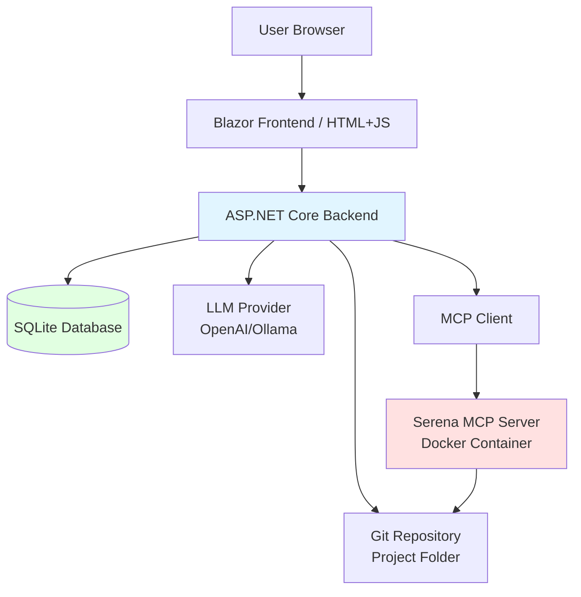

# Design Document: C# Refactoring Assistant

## Overview

The C# Refactoring Assistant is a locally-running ASP.NET Core web application that enables developers to perform semantic code refactoring through natural language commands. The system integrates three key technologies:

1. **Serena MCP Server** - Provides semantic analysis and editing of C# code through a Model Context Protocol interface
2. **LLM (OpenAI/Ollama)** - Interprets natural language prompts and generates appropriate tool calls
3. **Git** - Provides automatic checkpointing and rollback capabilities

The application maintains dialogue sessions tied to specific C# project folders, with full conversation history and checkpoint tracking persisted in SQLite. Each refactoring operation is preceded by an automatic Git commit, enabling safe experimentation with the ability to rollback to any previous state.

### Key Design Principles

- **Single Serena Instance**: One persistent MCP connection shared across all dialogues for performance
- **Safety First**: Automatic checkpoints before any code modification
- **Stateless Backend**: All state persisted in SQLite and Git, enabling application restarts without data loss
- **Clear Error Boundaries**: Explicit error handling at each integration point (LLM, Serena, Git)

## Architecture

### High-Level Architecture



### Component Layers

**Presentation Layer**
- Blazor components or HTML/JavaScript frontend
- Displays dialogue list, message history, checkpoint list
- Handles user input and displays responses

**Application Layer**
- Minimal API or MVC controllers
- Dialogue management endpoints
- Message processing orchestration
- Checkpoint and rollback endpoints

**Domain Layer**
- Dialogue, Message, Checkpoint entities
- Business logic for prompt processing workflow
- LLM integration with function calling
- Git operations wrapper

**Infrastructure Layer**
- Entity Framework Core with SQLite
- MCP Client (JSON-RPC 2.0 over stdio)
- Git command execution
- LLM API clients (OpenAI, Ollama)

## Components and Interfaces

### 1. Database Schema (Entity Framework Core)

**Dialogue Entity**
```csharp
public class Dialogue
{
    public int Id { get; set; }
    public string ProjectPath { get; set; }  // Absolute path to C# project
    public DateTime CreatedAt { get; set; }
    public List<Message> Messages { get; set; }
    public List<Checkpoint> Checkpoints { get; set; }
}
```

**Message Entity**
```csharp
public class Message
{
    public int Id { get; set; }
    public int DialogueId { get; set; }
    public Dialogue Dialogue { get; set; }
    public string Role { get; set; }  // "user" or "assistant"
    public string Content { get; set; }
    public DateTime Timestamp { get; set; }
}
```

**Checkpoint Entity**
```csharp
public class Checkpoint
{
    public int Id { get; set; }
    public int DialogueId { get; set; }
    public Dialogue Dialogue { get; set; }
    public string CommitHash { get; set; }
    public string Description { get; set; }
    public DateTime CreatedAt { get; set; }
}
```

**DbContext**
```csharp
public class RefactoringDbContext : DbContext
{
    public DbSet<Dialogue> Dialogues { get; set; }
    public DbSet<Message> Messages { get; set; }
    public DbSet<Checkpoint> Checkpoints { get; set; }
    
    protected override void OnModelCreating(ModelBuilder modelBuilder)
    {
        // Configure relationships and constraints
        modelBuilder.Entity<Message>()
            .HasOne(m => m.Dialogue)
            .WithMany(d => d.Messages)
            .HasForeignKey(m => m.DialogueId)
            .OnDelete(DeleteBehavior.Cascade);
            
        modelBuilder.Entity<Checkpoint>()
            .HasOne(c => c.Dialogue)
            .WithMany(d => d.Checkpoints)
            .HasForeignKey(c => c.DialogueId)
            .OnDelete(DeleteBehavior.Cascade);
    }
}
```

### 2. MCP Client for Serena

**IMcpClient Interface**
```csharp
public interface IMcpClient
{
    Task<McpResponse> CallToolAsync(string toolName, Dictionary<string, object> parameters);
    Task InitializeAsync();
    Task ShutdownAsync();
    bool IsConnected { get; }
}
```

**McpClient Implementation**
```csharp
public class McpClient : IMcpClient
{
    private Process _serenaProcess;
    private StreamWriter _stdin;
    private StreamReader _stdout;
    private int _requestId = 0;
    
    public async Task InitializeAsync()
    {
        // Start Serena process or connect to existing stdio streams
        // Verify connection with a ping or initialization call
    }
    
    public async Task<McpResponse> CallToolAsync(string toolName, Dictionary<string, object> parameters)
    {
        // Build JSON-RPC 2.0 request
        var request = new
        {
            jsonrpc = "2.0",
            id = Interlocked.Increment(ref _requestId),
            method = "tools/call",
            @params = new
            {
                name = toolName,
                arguments = parameters
            }
        };
        
        // Send request to stdin
        // Read response from stdout
        // Parse and return McpResponse
    }
    
    public async Task ShutdownAsync()
    {
        // Gracefully close streams and process
    }
}
```

**McpResponse Model**
```csharp
public class McpResponse
{
    public bool IsSuccess { get; set; }
    public object Result { get; set; }
    public string Error { get; set; }
}
```

### 3. Serena Tools Wrapper

**ISerenaService Interface**
```csharp
public interface ISerenaService
{
    Task<string> ActivateProjectAsync(string projectPath);
    Task<List<Symbol>> FindSymbolAsync(string symbolName);
    Task<List<Reference>> FindReferencingSymbolsAsync(string symbolId);
    Task<string> ReplaceSymbolBodyAsync(string symbolId, string newBody);
    Task<string> ExecuteShellCommandAsync(string command, string workingDirectory);
    Task<string> ReadFileAsync(string filePath);
    Task<string> InsertBeforeSymbolAsync(string symbolId, string content);
    Task<string> DeleteLinesAsync(string filePath, int startLine, int endLine);
}
```

**SerenaService Implementation**
```csharp
public class SerenaService : ISerenaService
{
    private readonly IMcpClient _mcpClient;
    
    public SerenaService(IMcpClient mcpClient)
    {
        _mcpClient = mcpClient;
    }
    
    public async Task<string> ActivateProjectAsync(string projectPath)
    {
        var response = await _mcpClient.CallToolAsync(
            "mcp__serena__activate_project",
            new Dictionary<string, object> { { "path", projectPath } }
        );
        
        if (!response.IsSuccess)
            throw new SerenaException($"Failed to activate project: {response.Error}");
            
        return response.Result?.ToString();
    }
    
    // Implement other methods similarly...
}
```

### 4. LLM Integration

**ILlmService Interface**
```csharp
public interface ILlmService
{
    Task<LlmResponse> SendPromptAsync(string prompt, List<Message> history, List<FunctionDefinition> tools);
}
```

**LlmResponse Model**
```csharp
public class LlmResponse
{
    public string TextContent { get; set; }
    public List<FunctionCall> FunctionCalls { get; set; }
}

public class FunctionCall
{
    public string Name { get; set; }
    public Dictionary<string, object> Arguments { get; set; }
}

public class FunctionDefinition
{
    public string Name { get; set; }
    public string Description { get; set; }
    public Dictionary<string, object> Parameters { get; set; }
}
```

**OpenAiLlmService Implementation**
```csharp
public class OpenAiLlmService : ILlmService
{
    private readonly HttpClient _httpClient;
    private readonly string _apiKey;
    private readonly string _model;
    
    public async Task<LlmResponse> SendPromptAsync(
        string prompt, 
        List<Message> history, 
        List<FunctionDefinition> tools)
    {
        // Build OpenAI API request with function calling
        var messages = history.Select(m => new
        {
            role = m.Role,
            content = m.Content
        }).ToList();
        
        messages.Add(new { role = "user", content = prompt });
        
        var request = new
        {
            model = _model,
            messages = messages,
            tools = tools.Select(t => new
            {
                type = "function",
                function = new
                {
                    name = t.Name,
                    description = t.Description,
                    parameters = t.Parameters
                }
            }).ToArray()
        };
        
        // Send HTTP request to OpenAI API
        // Parse response and extract function calls or text content
        // Return LlmResponse
    }
}
```

**OllamaLlmService Implementation**
```csharp
public class OllamaLlmService : ILlmService
{
    private readonly HttpClient _httpClient;
    private readonly string _model;
    
    public async Task<LlmResponse> SendPromptAsync(
        string prompt, 
        List<Message> history, 
        List<FunctionDefinition> tools)
    {
        // Similar to OpenAI but using Ollama's API format
        // May need to adapt function calling format based on Ollama's capabilities
    }
}
```

### 5. Git Operations

**IGitService Interface**
```csharp
public interface IGitService
{
    Task<bool> IsGitRepositoryAsync(string path);
    Task InitializeRepositoryAsync(string path);
    Task<string> CreateCheckpointAsync(string path, string message);
    Task RollbackToCheckpointAsync(string path, string commitHash);
    Task<bool> HasUncommittedChangesAsync(string path);
}
```

**GitService Implementation**
```csharp
public class GitService : IGitService
{
    public async Task<bool> IsGitRepositoryAsync(string path)
    {
        var gitDir = Path.Combine(path, ".git");
        return Directory.Exists(gitDir);
    }
    
    public async Task InitializeRepositoryAsync(string path)
    {
        // Execute: git init
        await ExecuteGitCommandAsync(path, "init");
        
        // Create .gitignore for .NET
        var gitignorePath = Path.Combine(path, ".gitignore");
        await File.WriteAllTextAsync(gitignorePath, GetDotNetGitignore());
        
        // Execute: git add .gitignore
        await ExecuteGitCommandAsync(path, "add .gitignore");
        
        // Execute: git commit -m "Initial commit"
        await ExecuteGitCommandAsync(path, "commit -m \"Initial commit\"");
    }
    
    public async Task<string> CreateCheckpointAsync(string path, string message)
    {
        // Execute: git add -A
        await ExecuteGitCommandAsync(path, "add -A");
        
        // Execute: git commit -m "{message}"
        await ExecuteGitCommandAsync(path, $"commit -m \"{message}\"");
        
        // Execute: git rev-parse HEAD
        var commitHash = await ExecuteGitCommandAsync(path, "rev-parse HEAD");
        return commitHash.Trim();
    }
    
    public async Task RollbackToCheckpointAsync(string path, string commitHash)
    {
        // Execute: git reset --hard {commitHash}
        await ExecuteGitCommandAsync(path, $"reset --hard {commitHash}");
    }
    
    public async Task<bool> HasUncommittedChangesAsync(string path)
    {
        // Execute: git status --porcelain
        var output = await ExecuteGitCommandAsync(path, "status --porcelain");
        return !string.IsNullOrWhiteSpace(output);
    }
    
    private async Task<string> ExecuteGitCommandAsync(string workingDirectory, string arguments)
    {
        var processStartInfo = new ProcessStartInfo
        {
            FileName = "git",
            Arguments = arguments,
            WorkingDirectory = workingDirectory,
            RedirectStandardOutput = true,
            RedirectStandardError = true,
            UseShellExecute = false,
            CreateNoWindow = true
        };
        
        using var process = Process.Start(processStartInfo);
        var output = await process.StandardOutput.ReadToEndAsync();
        var error = await process.StandardError.ReadToEndAsync();
        await process.WaitForExitAsync();
        
        if (process.ExitCode != 0)
            throw new GitException($"Git command failed: {error}");
            
        return output;
    }
    
    private string GetDotNetGitignore()
    {
        return @"
## Ignore Visual Studio temporary files, build results, and
## files generated by popular Visual Studio add-ons.

# User-specific files
*.suo
*.user
*.userosscache
*.sln.docstates

# Build results
[Dd]ebug/
[Dd]ebugPublic/
[Rr]elease/
[Rr]eleases/
x64/
x86/
[Bb]in/
[Oo]bj/

# Visual Studio cache/options directory
.vs/
";
    }
}
```

### 6. Prompt Processing Orchestration

**IPromptProcessor Interface**
```csharp
public interface IPromptProcessor
{
    Task<string> ProcessPromptAsync(int dialogueId, string prompt);
}
```

**PromptProcessor Implementation**
```csharp
public class PromptProcessor : IPromptProcessor
{
    private readonly RefactoringDbContext _dbContext;
    private readonly ILlmService _llmService;
    private readonly ISerenaService _serenaService;
    private readonly IGitService _gitService;
    private readonly ILogger<PromptProcessor> _logger;
    
    public async Task<string> ProcessPromptAsync(int dialogueId, string prompt)
    {
        // 1. Load dialogue and validate
        var dialogue = await _dbContext.Dialogues
            .Include(d => d.Messages)
            .FirstOrDefaultAsync(d => d.Id == dialogueId);
            
        if (dialogue == null)
            throw new ArgumentException("Dialogue not found");
        
        // 2. Save user message
        var userMessage = new Message
        {
            DialogueId = dialogueId,
            Role = "user",
            Content = prompt,
            Timestamp = DateTime.UtcNow
        };
        _dbContext.Messages.Add(userMessage);
        await _dbContext.SaveChangesAsync();
        
        try
        {
            // 3. Create checkpoint before LLM call
            var checkpointMessage = $"Checkpoint: {TruncatePrompt(prompt, 100)}";
            var commitHash = await _gitService.CreateCheckpointAsync(
                dialogue.ProjectPath, 
                checkpointMessage
            );
            
            var checkpoint = new Checkpoint
            {
                DialogueId = dialogueId,
                CommitHash = commitHash,
                Description = checkpointMessage,
                CreatedAt = DateTime.UtcNow
            };
            _dbContext.Checkpoints.Add(checkpoint);
            await _dbContext.SaveChangesAsync();
            
            // 4. Get Serena tool definitions
            var toolDefinitions = GetSerenaToolDefinitions();
            
            // 5. Send prompt to LLM
            var llmResponse = await _llmService.SendPromptAsync(
                prompt,
                dialogue.Messages.ToList(),
                toolDefinitions
            );
            
            // 6. Execute function calls if present
            var resultBuilder = new StringBuilder();
            
            if (llmResponse.FunctionCalls?.Any() == true)
            {
                foreach (var functionCall in llmResponse.FunctionCalls)
                {
                    var result = await ExecuteFunctionCallAsync(functionCall);
                    resultBuilder.AppendLine($"Executed {functionCall.Name}:");
                    resultBuilder.AppendLine(result);
                    resultBuilder.AppendLine();
                }
            }
            else if (!string.IsNullOrEmpty(llmResponse.TextContent))
            {
                resultBuilder.AppendLine(llmResponse.TextContent);
            }
            
            // 7. Save assistant response
            var assistantMessage = new Message
            {
                DialogueId = dialogueId,
                Role = "assistant",
                Content = resultBuilder.ToString(),
                Timestamp = DateTime.UtcNow
            };
            _dbContext.Messages.Add(assistantMessage);
            await _dbContext.SaveChangesAsync();
            
            return assistantMessage.Content;
        }
        catch (Exception ex)
        {
            _logger.LogError(ex, "Error processing prompt");
            
            // Save error as assistant message
            var errorMessage = new Message
            {
                DialogueId = dialogueId,
                Role = "assistant",
                Content = $"Error: {ex.Message}",
                Timestamp = DateTime.UtcNow
            };
            _dbContext.Messages.Add(errorMessage);
            await _dbContext.SaveChangesAsync();
            
            throw;
        }
    }
    
    private async Task<string> ExecuteFunctionCallAsync(FunctionCall functionCall)
    {
        // Map function call to appropriate Serena service method
        return functionCall.Name switch
        {
            "mcp__serena__find_symbol" => 
                await ExecuteFindSymbolAsync(functionCall.Arguments),
            "mcp__serena__find_referencing_symbols" => 
                await ExecuteFindReferencingSymbolsAsync(functionCall.Arguments),
            "mcp__serena__replace_symbol_body" => 
                await ExecuteReplaceSymbolBodyAsync(functionCall.Arguments),
            "mcp__serena__execute_shell_command" => 
                await ExecuteShellCommandAsync(functionCall.Arguments),
            _ => throw new NotSupportedException($"Unknown function: {functionCall.Name}")
        };
    }
    
    private List<FunctionDefinition> GetSerenaToolDefinitions()
    {
        return new List<FunctionDefinition>
        {
            new FunctionDefinition
            {
                Name = "mcp__serena__find_symbol",
                Description = "Find a symbol (class, method, property) by name in the C# project",
                Parameters = new Dictionary<string, object>
                {
                    ["type"] = "object",
                    ["properties"] = new Dictionary<string, object>
                    {
                        ["symbolName"] = new Dictionary<string, object>
                        {
                            ["type"] = "string",
                            ["description"] = "The name of the symbol to find"
                        }
                    },
                    ["required"] = new[] { "symbolName" }
                }
            },
            new FunctionDefinition
            {
                Name = "mcp__serena__find_referencing_symbols",
                Description = "Find all references to a specific symbol",
                Parameters = new Dictionary<string, object>
                {
                    ["type"] = "object",
                    ["properties"] = new Dictionary<string, object>
                    {
                        ["symbolId"] = new Dictionary<string, object>
                        {
                            ["type"] = "string",
                            ["description"] = "The ID of the symbol to find references for"
                        }
                    },
                    ["required"] = new[] { "symbolId" }
                }
            },
            new FunctionDefinition
            {
                Name = "mcp__serena__replace_symbol_body",
                Description = "Replace the body of a method or class",
                Parameters = new Dictionary<string, object>
                {
                    ["type"] = "object",
                    ["properties"] = new Dictionary<string, object>
                    {
                        ["symbolId"] = new Dictionary<string, object>
                        {
                            ["type"] = "string",
                            ["description"] = "The ID of the symbol to replace"
                        },
                        ["newBody"] = new Dictionary<string, object>
                        {
                            ["type"] = "string",
                            ["description"] = "The new body content"
                        }
                    },
                    ["required"] = new[] { "symbolId", "newBody" }
                }
            },
            new FunctionDefinition
            {
                Name = "mcp__serena__execute_shell_command",
                Description = "Execute a shell command (e.g., dotnet build)",
                Parameters = new Dictionary<string, object>
                {
                    ["type"] = "object",
                    ["properties"] = new Dictionary<string, object>
                    {
                        ["command"] = new Dictionary<string, object>
                        {
                            ["type"] = "string",
                            ["description"] = "The command to execute"
                        }
                    },
                    ["required"] = new[] { "command" }
                }
            }
        };
    }
}
```

### 7. API Endpoints

**Dialogue Endpoints**
```csharp
// POST /api/dialogues
// Create new dialogue
app.MapPost("/api/dialogues", async (
    CreateDialogueRequest request,
    RefactoringDbContext dbContext,
    IGitService gitService,
    ISerenaService serenaService) =>
{
    // Validate project path
    if (!Path.IsPathFullyQualified(request.ProjectPath))
        return Results.BadRequest("Project path must be absolute");
        
    if (!Directory.Exists(request.ProjectPath))
        return Results.BadRequest("Project path does not exist");
    
    // Initialize Git if needed
    if (!await gitService.IsGitRepositoryAsync(request.ProjectPath))
    {
        await gitService.InitializeRepositoryAsync(request.ProjectPath);
    }
    
    // Create dialogue
    var dialogue = new Dialogue
    {
        ProjectPath = request.ProjectPath,
        CreatedAt = DateTime.UtcNow
    };
    
    dbContext.Dialogues.Add(dialogue);
    await dbContext.SaveChangesAsync();
    
    // Activate project in Serena
    await serenaService.ActivateProjectAsync(request.ProjectPath);
    
    return Results.Ok(dialogue);
});

// GET /api/dialogues
// Get all dialogues
app.MapGet("/api/dialogues", async (RefactoringDbContext dbContext) =>
{
    var dialogues = await dbContext.Dialogues
        .OrderByDescending(d => d.CreatedAt)
        .ToListAsync();
    return Results.Ok(dialogues);
});

// GET /api/dialogues/{id}
// Get dialogue with messages
app.MapGet("/api/dialogues/{id}", async (
    int id,
    RefactoringDbContext dbContext) =>
{
    var dialogue = await dbContext.Dialogues
        .Include(d => d.Messages.OrderBy(m => m.Timestamp))
        .Include(d => d.Checkpoints.OrderByDescending(c => c.CreatedAt))
        .FirstOrDefaultAsync(d => d.Id == id);
        
    if (dialogue == null)
        return Results.NotFound();
        
    return Results.Ok(dialogue);
});
```

**Message Endpoints**
```csharp
// POST /api/dialogues/{id}/messages
// Send new message
app.MapPost("/api/dialogues/{id}/messages", async (
    int id,
    SendMessageRequest request,
    IPromptProcessor promptProcessor) =>
{
    try
    {
        var response = await promptProcessor.ProcessPromptAsync(id, request.Content);
        return Results.Ok(new { content = response });
    }
    catch (Exception ex)
    {
        return Results.Problem(ex.Message);
    }
});
```

**Checkpoint Endpoints**
```csharp
// GET /api/dialogues/{id}/checkpoints
// Get checkpoints for dialogue
app.MapGet("/api/dialogues/{id}/checkpoints", async (
    int id,
    RefactoringDbContext dbContext) =>
{
    var checkpoints = await dbContext.Checkpoints
        .Where(c => c.DialogueId == id)
        .OrderByDescending(c => c.CreatedAt)
        .ToListAsync();
        
    return Results.Ok(checkpoints);
});

// POST /api/dialogues/{id}/rollback
// Rollback to checkpoint
app.MapPost("/api/dialogues/{id}/rollback", async (
    int id,
    RollbackRequest request,
    RefactoringDbContext dbContext,
    IGitService gitService,
    ISerenaService serenaService) =>
{
    var dialogue = await dbContext.Dialogues.FindAsync(id);
    if (dialogue == null)
        return Results.NotFound();
        
    var checkpoint = await dbContext.Checkpoints.FindAsync(request.CheckpointId);
    if (checkpoint == null || checkpoint.DialogueId != id)
        return Results.NotFound("Checkpoint not found");
    
    // Check for uncommitted changes
    if (await gitService.HasUncommittedChangesAsync(dialogue.ProjectPath))
        return Results.BadRequest("Cannot rollback with uncommitted changes");
    
    // Perform rollback
    await gitService.RollbackToCheckpointAsync(dialogue.ProjectPath, checkpoint.CommitHash);
    
    // Reactivate project in Serena
    await serenaService.ActivateProjectAsync(dialogue.ProjectPath);
    
    return Results.Ok(new { message = "Rollback successful" });
});
```

### 8. Frontend Interface

**Blazor Component Structure** (if using Blazor)
```
Components/
  ├── DialogueList.razor       # List of all dialogues
  ├── DialogueView.razor        # Single dialogue with messages
  ├── MessageList.razor         # Display message history
  ├── MessageInput.razor        # Input field and send button
  ├── CheckpointList.razor      # List of checkpoints with rollback
  └── CreateDialogue.razor      # Form to create new dialogue
```

**Alternative: Simple HTML/JS** (if not using Blazor)
```html
<!-- index.html -->
<div id="app">
  <div id="dialogue-list">
    <!-- List of dialogues -->
  </div>
  <div id="dialogue-view">
    <div id="message-list">
      <!-- Message history -->
    </div>
    <div id="message-input">
      <input type="text" id="prompt-input" />
      <button id="send-button">Send</button>
    </div>
    <div id="checkpoint-list">
      <!-- Checkpoint list with rollback buttons -->
    </div>
  </div>
</div>

<script>
  // Fetch API calls to backend endpoints
  // DOM manipulation for displaying messages
  // Event handlers for user interactions
</script>
```

## Data Models

### Request/Response Models

**CreateDialogueRequest**
```csharp
public record CreateDialogueRequest(string ProjectPath);
```

**SendMessageRequest**
```csharp
public record SendMessageRequest(string Content);
```

**RollbackRequest**
```csharp
public record RollbackRequest(int CheckpointId);
```

### Configuration Models

**AppSettings**
```json
{
  "ConnectionStrings": {
    "DefaultConnection": "Data Source=refactoring.db"
  },
  "Llm": {
    "Provider": "OpenAI",
    "OpenAI": {
      "ApiKey": "your-api-key",
      "Model": "deepseek-chat",
      "BaseUrl": "https://api.deepseek.com/v1"
    },
    "Ollama": {
      "BaseUrl": "http://localhost:11434",
      "Model": "llama2"
    }
  },
  "Serena": {
    "StdioCommand": "docker",
    "StdioArgs": ["exec", "-i", "serena-container", "serena-mcp"]
  },
  "Security": {
    "AllowedRootDirectory": null
  }
}
```

**LlmConfiguration**
```csharp
public class LlmConfiguration
{
    public string Provider { get; set; }
    public OpenAIConfiguration OpenAI { get; set; }
    public OllamaConfiguration Ollama { get; set; }
}

public class OpenAIConfiguration
{
    public string ApiKey { get; set; }
    public string Model { get; set; }
    public string BaseUrl { get; set; }
}

public class OllamaConfiguration
{
    public string BaseUrl { get; set; }
    public string Model { get; set; }
}
```


## Correctness Properties

A property is a characteristic or behavior that should hold true across all valid executions of a system—essentially, a formal statement about what the system should do. Properties serve as the bridge between human-readable specifications and machine-verifiable correctness guarantees.

### Property 1: Dialogue Creation Persistence
*For any* valid absolute project path, creating a dialogue should result in a database record with that path and a valid ID.
**Validates: Requirements 1.1**

### Property 2: Dialogue Retrieval Completeness
*For any* set of created dialogues, querying all dialogues should return exactly the same set with all project paths intact.
**Validates: Requirements 1.2**

### Property 3: Message History Completeness
*For any* dialogue with messages, loading that dialogue should return all messages in chronological order with correct roles and content.
**Validates: Requirements 1.3**

### Property 4: Invalid Path Rejection
*For any* invalid path (relative, non-existent, or file instead of directory), dialogue creation should fail with a descriptive error message.
**Validates: Requirements 1.4, 8.1, 8.4**

### Property 5: Entity Field Completeness
*For any* created entity (dialogue, message, or checkpoint), all required fields (ID, timestamps, foreign keys, content) should be present and non-null.
**Validates: Requirements 1.5, 7.2, 7.3, 7.4**

### Property 6: Message Processing Round Trip
*For any* user prompt submitted to a dialogue, the system should save the user message, process it, save an assistant response, and return that response to the caller.
**Validates: Requirements 2.1, 2.4, 2.5**

### Property 7: Tool Call Execution Order
*For any* LLM response containing multiple function calls, the system should execute them sequentially in the order specified by the LLM.
**Validates: Requirements 2.3, 6.4**

### Property 8: Pipeline Error Propagation
*For any* failure point in the processing pipeline (LLM, Serena, Git), the system should return a clear error message to the user without crashing.
**Validates: Requirements 2.6, 9.1, 9.2, 9.3**

### Property 9: Project Activation on Dialogue Operations
*For any* dialogue creation or switch operation, the system should call Serena's activate_project with the correct project path.
**Validates: Requirements 3.2, 5.3**

### Property 10: Serena Error Context
*For any* Serena tool call failure, the error message should include the tool name and the reason for failure.
**Validates: Requirements 3.4, 9.1**

### Property 11: Tool Name Validation
*For any* LLM-requested tool call, the system should validate the tool name exists before attempting execution, rejecting unknown tools.
**Validates: Requirements 3.5**

### Property 12: JSON-RPC 2.0 Protocol Compliance
*For any* MCP client request to Serena, the message should conform to JSON-RPC 2.0 specification (jsonrpc: "2.0", id, method, params).
**Validates: Requirements 3.6**

### Property 13: Git Repository Initialization
*For any* project folder that is not a Git repository, creating a dialogue should initialize Git with .gitignore and an initial commit.
**Validates: Requirements 4.1, 4.2**

### Property 14: Checkpoint Creation Before Modification
*For any* user prompt that may modify files, a Git checkpoint should be created before the LLM is called, with commit message format "Checkpoint: {description}".
**Validates: Requirements 4.3, 4.4, 4.5**

### Property 15: Checkpoint Failure Aborts Operation
*For any* checkpoint creation failure, the refactoring operation should be aborted and an error returned without calling the LLM.
**Validates: Requirements 4.6**

### Property 16: Checkpoint Ordering
*For any* dialogue with multiple checkpoints, querying checkpoints should return them ordered by timestamp (newest first).
**Validates: Requirements 5.1**

### Property 17: Rollback Execution
*For any* valid checkpoint, initiating rollback should execute git reset --hard with the checkpoint's commit hash and reactivate the project in Serena.
**Validates: Requirements 5.2, 5.3**

### Property 18: Rollback Uncommitted Changes Prevention
*For any* project folder with uncommitted changes, rollback operations should be rejected with an error message.
**Validates: Requirements 5.5**

### Property 19: LLM Request Composition
*For any* prompt sent to the LLM, the request should include all Serena tool definitions and the complete dialogue history for context.
**Validates: Requirements 6.3, 6.6**

### Property 20: Text Response Passthrough
*For any* LLM response containing only text (no function calls), the system should return the text directly to the user without modification.
**Validates: Requirements 6.5**

### Property 21: Referential Integrity Cascade
*For any* dialogue deletion, all associated messages and checkpoints should be automatically deleted (cascade delete).
**Validates: Requirements 7.6**

### Property 22: Path Restriction Enforcement
*For any* configured root directory restriction, project paths outside that root should be rejected during validation.
**Validates: Requirements 8.2**

### Property 23: Path Normalization Before Validation
*For any* project path containing symbolic links or relative components (../, ./), the system should resolve them to absolute paths before validation.
**Validates: Requirements 8.3**

### Property 24: Path Sanitization
*For any* file path passed to Serena or Git commands, special characters should be properly escaped or sanitized to prevent command injection.
**Validates: Requirements 8.5**

### Property 25: MCP Reconnection on Failure
*For any* MCP connection loss, the system should attempt to reconnect and notify the user of the connection status.
**Validates: Requirements 9.4**

### Property 26: Error Logging with Context
*For any* error occurrence, the system should create a log entry with timestamp, error message, and contextual information (dialogue ID, operation type).
**Validates: Requirements 9.5**

### Property 27: Serena Connection Singleton
*For any* number of dialogues created during application lifetime, only one MCP connection to Serena should exist and be reused.
**Validates: Requirements 11.2, 11.5**

### Property 28: Build Command Execution
*For any* build verification request, the system should execute "dotnet build" via Serena's execute_shell_command and return the complete output.
**Validates: Requirements 12.1, 12.2**

### Property 29: Build Failure Formatting
*For any* failed build, the error output should be formatted for readability (preserving line breaks and error structure) in the chat response.
**Validates: Requirements 12.3**

### Property 30: Auto-Build No Rollback
*For any* automatic build verification failure, the system should notify the user but not perform an automatic rollback.
**Validates: Requirements 12.5**

## Error Handling

### Error Categories and Handling Strategies

**1. Validation Errors** (User Input)
- Invalid project paths (relative, non-existent, outside allowed root)
- Invalid checkpoint IDs
- Uncommitted changes during rollback
- Strategy: Return 400 Bad Request with descriptive message, do not modify state

**2. External Service Errors** (LLM, Serena)
- LLM API unavailable or rate limited
- Serena MCP connection lost
- Serena tool execution failures
- Strategy: Return 503 Service Unavailable, log error with context, attempt reconnection for MCP

**3. Git Operation Errors**
- Git command failures (init, commit, reset)
- Merge conflicts during rollback
- Strategy: Return 500 Internal Server Error, preserve repository state, log git output

**4. Database Errors**
- Connection failures
- Constraint violations
- Strategy: Return 500 Internal Server Error, log full exception, ensure transactions rollback

**5. System Errors**
- Out of memory
- Disk full
- Permission denied
- Strategy: Return 500 Internal Server Error, log critical error, graceful degradation

### Error Response Format

All API errors should return consistent JSON structure:
```json
{
  "error": {
    "code": "DIALOGUE_NOT_FOUND",
    "message": "Dialogue with ID 123 does not exist",
    "details": {
      "dialogueId": 123,
      "operation": "send_message"
    }
  }
}
```

### Retry and Recovery

**MCP Connection Loss**
- Automatic retry: 3 attempts with exponential backoff (1s, 2s, 4s)
- If all retries fail: Return error to user, mark connection as down
- Background reconnection: Attempt every 30 seconds
- On successful reconnection: Reactivate last active project

**LLM API Failures**
- Transient errors (429, 503): Retry once after 2 seconds
- Authentication errors (401): Fail immediately, log configuration issue
- Timeout: Fail after 60 seconds, return timeout error

**Git Operation Failures**
- No automatic retry (git operations should be deterministic)
- Provide git command output in error message for user debugging
- Suggest manual intervention if needed

### Logging Strategy

**Log Levels**
- ERROR: All exceptions, failed operations, external service failures
- WARNING: Retry attempts, degraded functionality, validation failures
- INFO: Dialogue creation, checkpoint creation, rollback operations
- DEBUG: MCP messages, LLM requests/responses, git commands

**Log Context**
- Timestamp (UTC)
- Dialogue ID (if applicable)
- User prompt (truncated to 100 chars)
- Operation type
- Error details and stack trace

## Testing Strategy

### Dual Testing Approach

The application requires both unit tests and property-based tests for comprehensive coverage:

**Unit Tests** focus on:
- Specific examples demonstrating correct behavior
- Edge cases (empty inputs, boundary conditions)
- Error conditions and exception handling
- Integration points between components
- UI component rendering and interaction

**Property-Based Tests** focus on:
- Universal properties that hold for all inputs
- Comprehensive input coverage through randomization
- Invariants that must be maintained across operations
- Round-trip properties (serialize/deserialize, create/retrieve)

Both testing approaches are complementary and necessary. Unit tests catch concrete bugs in specific scenarios, while property tests verify general correctness across a wide input space.

### Property-Based Testing Configuration

**Framework**: Use a property-based testing library for C#:
- **Recommended**: FsCheck (mature, well-documented, supports C#)
- Alternative: CsCheck (newer, simpler API)

**Test Configuration**:
- Minimum 100 iterations per property test (due to randomization)
- Each property test must include a comment tag referencing the design property
- Tag format: `// Feature: csharp-refactoring-assistant, Property {number}: {property_text}`

**Example Property Test Structure**:
```csharp
[Fact]
public void Property1_DialogueCreationPersistence()
{
    // Feature: csharp-refactoring-assistant, Property 1: Dialogue Creation Persistence
    Prop.ForAll(
        Arb.Generate<string>().Where(IsValidAbsolutePath),
        async (projectPath) =>
        {
            // Arrange
            var dbContext = CreateInMemoryDbContext();
            var service = new DialogueService(dbContext);
            
            // Act
            var dialogue = await service.CreateDialogueAsync(projectPath);
            
            // Assert
            var retrieved = await dbContext.Dialogues.FindAsync(dialogue.Id);
            return retrieved != null && retrieved.ProjectPath == projectPath;
        }
    ).QuickCheckThrowOnFailure();
}
```

### Unit Testing Strategy

**Test Organization**:
- Separate test projects for each layer (API, Services, Infrastructure)
- Use in-memory SQLite for database tests
- Mock external dependencies (LLM, Serena MCP, Git)

**Key Unit Test Areas**:

1. **API Endpoints**
   - Valid request handling
   - Invalid request rejection
   - Error response formatting
   - Authentication/authorization (if added)

2. **Prompt Processing**
   - User message saved before LLM call
   - Checkpoint created before LLM call
   - Function calls executed in order
   - Assistant response saved after execution
   - Error handling at each step

3. **MCP Client**
   - JSON-RPC 2.0 message formatting
   - Request/response parsing
   - Connection management
   - Error handling

4. **Git Service**
   - Repository detection
   - Initialization with .gitignore
   - Checkpoint creation
   - Rollback execution
   - Uncommitted changes detection

5. **Serena Service**
   - Tool call parameter mapping
   - Response parsing
   - Error handling

6. **LLM Service**
   - Request formatting with tools and history
   - Function call parsing
   - Text response handling
   - Provider switching (OpenAI/Ollama)

### Integration Testing

**End-to-End Scenarios**:
1. Create dialogue → Send prompt → Verify checkpoint → Verify response
2. Create dialogue → Send multiple prompts → Verify history
3. Create dialogue → Send prompt → Rollback → Verify state
4. Create dialogue with non-git folder → Verify git initialization

**Test Environment**:
- Use Docker Compose to start Serena MCP server
- Use test SQLite database (separate from production)
- Mock LLM responses for deterministic testing
- Use temporary directories for git operations

### Manual Testing Checklist

**UI Testing**:
- [ ] Dialogue list displays correctly
- [ ] Message history shows user/assistant distinction
- [ ] Input field and send button work
- [ ] Loading indicator appears during processing
- [ ] Checkpoint list displays with rollback buttons
- [ ] Error messages display clearly

**Functional Testing**:
- [ ] Create dialogue with valid C# project
- [ ] Send refactoring command (e.g., "Find all [Authorize] attributes")
- [ ] Verify checkpoint created in git log
- [ ] Verify code changes applied
- [ ] Rollback to previous checkpoint
- [ ] Verify code reverted

**Error Scenarios**:
- [ ] Invalid project path rejected
- [ ] Serena not running shows clear error
- [ ] LLM API key invalid shows clear error
- [ ] Rollback with uncommitted changes rejected
- [ ] Unknown tool name handled gracefully

### Performance Testing

**Key Metrics**:
- Dialogue creation: < 500ms (including git init if needed)
- Message processing: < 5s (excluding LLM API latency)
- Checkpoint creation: < 200ms
- Rollback: < 1s
- Dialogue list retrieval: < 100ms

**Load Testing**:
- Test with 100+ dialogues
- Test with 1000+ messages per dialogue
- Test with 50+ checkpoints per dialogue
- Verify no memory leaks with long-running application

### Security Testing

**Path Traversal**:
- Test with paths containing ../
- Test with symbolic links
- Test with paths outside allowed root (if configured)

**Command Injection**:
- Test with project paths containing shell metacharacters
- Test with prompts containing shell metacharacters
- Verify all inputs sanitized before passing to git/Serena

**Data Validation**:
- Test with extremely long prompts (> 10KB)
- Test with special characters in all inputs
- Test with malformed JSON in API requests
