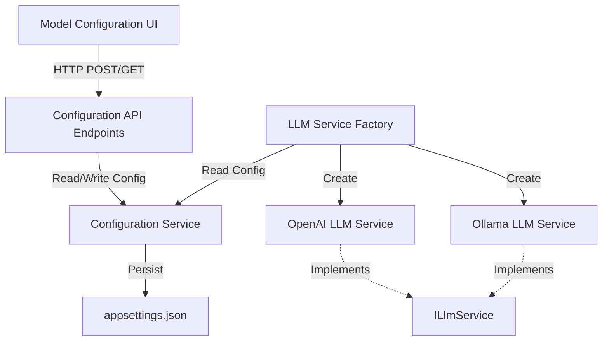

# Design Document: Model Configuration UI

## Overview

The Model Configuration UI feature extends the C# Refactoring Assistant with a user-friendly interface for configuring LLM providers and models. The design introduces a tabbed configuration panel, backend API endpoints for configuration management, and a flexible service factory pattern to support multiple LLM providers (cloud-based and local).

The architecture maintains separation of concerns by:
- Keeping UI logic in the frontend (HTML/JavaScript)
- Managing configuration persistence through dedicated backend services
- Using a factory pattern to instantiate appropriate LLM service implementations
- Preserving the existing ILlmService interface for backward compatibility

## Architecture

### High-Level Architecture



### Component Interaction Flow

1. **Configuration Update Flow**:
   - User modifies settings in Model Configuration UI
   - UI sends POST request to `/api/configuration` endpoint
   - Configuration Service validates and persists settings to appsettings.json
   - LLM Service Factory reads updated configuration
   - Factory creates new LLM service instance with updated settings

2. **Configuration Load Flow**:
   - Application starts or user opens configuration UI
   - UI sends GET request to `/api/configuration` endpoint
   - Configuration Service reads current settings from appsettings.json
   - Settings are returned to UI and displayed in appropriate tab

3. **LLM Request Flow**:
   - User sends message through dialogue interface
   - Prompt Processor requests LLM service from Factory
   - Factory returns appropriate service instance based on Active Configuration
   - LLM service processes request using configured provider/model

## Components and Interfaces

### 1. Frontend Components

#### ModelConfigurationUI (JavaScript)

**Responsibility**: Manage the model configuration interface, handle user input, and communicate with backend API.

**Key Functions**:
```javascript
// Load current configuration from backend
async function loadConfiguration()

// Save configuration to backend
async function saveConfiguration(config)

// Switch between Provider and Local tabs
function switchTab(tabName)

// Validate form inputs before submission
function validateConfiguration(config)

// Display success/error messages
function showMessage(message, type)

// Test connection to configured LLM
async function testConnection()
```

**State Management**:
- Current active tab (Provider or Local)
- Form field values for each tab
- Validation errors
- Loading/saving state

#### UI Structure (HTML)

```html
<div id="model-config-modal">
  <div class="tabs">
    <button class="tab-button active" data-tab="provider">Provider</button>
    <button class="tab-button" data-tab="local">Local</button>
  </div>
  
  <div id="provider-tab" class="tab-content active">
    <input type="text" id="provider-base-url" placeholder="Base URL">
    <input type="password" id="provider-api-key" placeholder="API Key">
    <input type="text" id="provider-model" placeholder="Model Name">
    <button id="save-provider">Save</button>
  </div>
  
  <div id="local-tab" class="tab-content">
    <input type="text" id="ollama-base-url" placeholder="Ollama URL">
    <select id="ollama-model">
      <option value="">Select Model</option>
    </select>
    <button id="refresh-models">Refresh Models</button>
    <button id="save-local">Save</button>
  </div>
  
  <div id="status-message"></div>
</div>
```

### 2. Backend Components

#### ConfigurationService

**Responsibility**: Manage reading and writing of LLM configuration settings.

**Interface**:
```csharp
public interface IConfigurationService
{
    Task<LlmConfiguration> GetConfigurationAsync();
    Task SaveConfigurationAsync(LlmConfiguration config);
    Task<bool> ValidateConfigurationAsync(LlmConfiguration config);
}
```

**Implementation Details**:
- Reads from and writes to appsettings.json
- Uses IConfiguration for reading current settings
- Uses JSON serialization for writing updates
- Validates configuration before persisting
- Notifies dependent services of configuration changes

**Key Methods**:
```csharp
public class ConfigurationService : IConfigurationService
{
    private readonly IConfiguration _configuration;
    private readonly ILogger<ConfigurationService> _logger;
    private readonly string _configFilePath;
    
    public async Task<LlmConfiguration> GetConfigurationAsync()
    {
        // Read current configuration from IConfiguration
        // Map to LlmConfiguration DTO
        // Return configuration object
    }
    
    public async Task SaveConfigurationAsync(LlmConfiguration config)
    {
        // Validate configuration
        // Read appsettings.json file
        // Update Llm section with new values
        // Write back to file
        // Reload IConfiguration
    }
    
    public async Task<bool> ValidateConfigurationAsync(LlmConfiguration config)
    {
        // Validate required fields based on provider type
        // Validate URL formats
        // Return validation result
    }
}
```

#### LlmServiceFactory

**Responsibility**: Create appropriate ILlmService instances based on current configuration.

**Interface**:
```csharp
public interface ILlmServiceFactory
{
    ILlmService CreateLlmService();
}
```

**Implementation**:
```csharp
public class LlmServiceFactory : ILlmServiceFactory
{
    private readonly IConfiguration _configuration;
    private readonly IHttpClientFactory _httpClientFactory;
    private readonly ILogger<LlmServiceFactory> _logger;
    
    public ILlmService CreateLlmService()
    {
        var provider = _configuration["Llm:Provider"];
        
        return provider?.ToLower() switch
        {
            "openai" => CreateOpenAiService(),
            "ollama" => CreateOllamaService(),
            _ => CreateOpenAiService() // Default fallback
        };
    }
    
    private ILlmService CreateOpenAiService()
    {
        var httpClient = _httpClientFactory.CreateClient();
        return new OpenAiLlmService(httpClient, _configuration, _logger);
    }
    
    private ILlmService CreateOllamaService()
    {
        var httpClient = _httpClientFactory.CreateClient();
        return new OllamaLlmService(httpClient, _configuration, _logger);
    }
}
```

#### OllamaLlmService

**Responsibility**: Implement ILlmService for local Ollama installations.

**Interface**: Implements `ILlmService`

**Implementation**:
```csharp
public class OllamaLlmService : ILlmService
{
    private readonly HttpClient _httpClient;
    private readonly string _baseUrl;
    private readonly string _model;
    private readonly ILogger<OllamaLlmService> _logger;
    
    public OllamaLlmService(
        HttpClient httpClient,
        IConfiguration configuration,
        ILogger<OllamaLlmService> logger)
    {
        _httpClient = httpClient;
        _logger = logger;
        _baseUrl = configuration["Llm:Ollama:BaseUrl"] 
            ?? "http://localhost:11434";
        _model = configuration["Llm:Ollama:Model"] 
            ?? throw new ArgumentException("Ollama model not configured");
    }
    
    public async Task<LlmResponse> SendPromptAsync(
        string prompt,
        List<Message> history,
        List<FunctionDefinition> tools)
    {
        // Build Ollama-compatible request
        // Send to Ollama API endpoint
        // Parse response
        // Map to LlmResponse
        // Handle tool calls if supported
    }
}
```

#### API Endpoints

**GET /api/configuration**
- Returns current LLM configuration
- Response: `LlmConfiguration` object

**POST /api/configuration**
- Accepts new configuration settings
- Validates configuration
- Persists to appsettings.json
- Returns success/error response

**GET /api/configuration/ollama/models**
- Fetches available models from Ollama instance
- Returns list of model names
- Handles connection errors gracefully

**POST /api/configuration/test**
- Tests connection to configured LLM
- Sends simple test prompt
- Returns success/error with details

## Data Models

### LlmConfiguration

```csharp
public class LlmConfiguration
{
    public string Provider { get; set; } // "OpenAI" or "Ollama"
    public ProviderSettings? OpenAI { get; set; }
    public OllamaSettings? Ollama { get; set; }
}

public class ProviderSettings
{
    public string ApiKey { get; set; }
    public string Model { get; set; }
    public string BaseUrl { get; set; }
}

public class OllamaSettings
{
    public string BaseUrl { get; set; }
    public string Model { get; set; }
}
```

### Configuration API Request/Response Models

```csharp
public class SaveConfigurationRequest
{
    public string Provider { get; set; }
    public ProviderSettings? OpenAI { get; set; }
    public OllamaSettings? Ollama { get; set; }
}

public class ConfigurationResponse
{
    public bool Success { get; set; }
    public string? Message { get; set; }
    public LlmConfiguration? Configuration { get; set; }
}

public class OllamaModelsResponse
{
    public List<string> Models { get; set; }
}

public class TestConnectionResponse
{
    public bool Success { get; set; }
    public string Message { get; set; }
}
```

### appsettings.json Structure

```json
{
  "Llm": {
    "Provider": "OpenAI",
    "OpenAI": {
      "ApiKey": "sk-...",
      "Model": "deepseek-chat",
      "BaseUrl": "https://api.deepseek.com/v1"
    },
    "Ollama": {
      "BaseUrl": "http://localhost:11434",
      "Model": "llama2"
    }
  }
}
```


## Correctness Properties

A property is a characteristic or behavior that should hold true across all valid executions of a system—essentially, a formal statement about what the system should do. Properties serve as the bridge between human-readable specifications and machine-verifiable correctness guarantees.

### Property 1: Configuration Persistence Round-Trip

*For any* valid LlmConfiguration object (including provider type, API keys, base URLs, and model names), saving the configuration and then loading it should produce an equivalent configuration with all fields preserved.

**Validates: Requirements 4.1, 4.2, 4.4, 4.5, 7.2**

### Property 2: Tab State Preservation

*For any* set of input values entered in a tab, switching to another tab and then switching back should preserve all the original input values unchanged.

**Validates: Requirements 1.2**

### Property 3: Configuration Display on Load

*For any* saved configuration, opening the Model Configuration UI should display all configuration values in the appropriate form fields matching the saved values.

**Validates: Requirements 1.4**

### Property 4: API Key Masking

*For any* API key string entered in the provider tab, the displayed value in the input field should be masked (showing dots or asterisks instead of the actual characters).

**Validates: Requirements 2.4, 7.1**

### Property 5: Required Field Validation

*For any* configuration save attempt where required fields (API key for provider, base URL for provider/local) are empty or contain only whitespace, the validation should reject the configuration and prevent saving.

**Validates: Requirements 2.5, 3.3**

### Property 6: URL Format Validation

*For any* base URL input (provider or Ollama), if the URL is not in valid URL format, the validation should reject it; if it is in valid format, the validation should accept it.

**Validates: Requirements 2.6, 3.4**

### Property 7: Active Configuration Update

*For any* valid configuration (provider or local), successfully saving the configuration should result in the Active_Configuration being updated to use the new settings.

**Validates: Requirements 2.7, 3.5**

### Property 8: Configuration Changes Apply Immediately

*For any* configuration change, subsequent LLM service operations should use the new configuration settings without requiring application restart.

**Validates: Requirements 4.3**

### Property 9: Validation Error Display

*For any* invalid input data (empty required fields, invalid URLs, incomplete configuration), the UI should display appropriate validation error messages.

**Validates: Requirements 5.1, 5.2**

### Property 10: Save Feedback Messaging

*For any* configuration save operation, the UI should display a success message if the save succeeds, or an error message with details if the save fails.

**Validates: Requirements 5.3, 5.4**

### Property 11: LLM Service Factory Type Selection

*For any* configuration specifying a provider type (OpenAI/provider or Ollama/local), the LLM Service Factory should create an instance of the corresponding service type that implements ILlmService.

**Validates: Requirements 6.1, 6.2, 6.4**

### Property 12: Service Configuration Propagation

*For any* configuration change, the LLM service instance created by the factory should use the settings from the new configuration.

**Validates: Requirements 6.3**

### Property 13: API Key Removal

*For any* configuration with an API key, clearing the API key field and saving should result in the stored configuration having no API key value (empty or null).

**Validates: Requirements 7.4**

### Property 14: Loading Indicator During Save

*For any* configuration save operation, while the save is in progress, the UI should display a loading indicator.

**Validates: Requirements 8.4**

## Error Handling

### Configuration Validation Errors

**Scenario**: User submits invalid configuration
- **Detection**: ConfigurationService.ValidateConfigurationAsync returns false
- **Response**: Return 400 Bad Request with validation error details
- **User Feedback**: Display specific validation errors in UI (e.g., "API key is required", "Invalid URL format")

### Configuration File Access Errors

**Scenario**: Unable to read or write appsettings.json
- **Detection**: IOException or UnauthorizedAccessException during file operations
- **Response**: Log error, return 500 Internal Server Error
- **User Feedback**: Display generic error message: "Unable to save configuration. Please check file permissions."
- **Fallback**: Continue using in-memory configuration

### Ollama Connection Errors

**Scenario**: Unable to connect to Ollama instance
- **Detection**: HttpRequestException when fetching models or testing connection
- **Response**: Return error response with connection details
- **User Feedback**: Display: "Unable to connect to Ollama at [URL]. Please verify Ollama is running."
- **Fallback**: Allow user to manually enter model name

### LLM Service Creation Errors

**Scenario**: Factory unable to create LLM service due to invalid configuration
- **Detection**: ArgumentException or configuration missing required values
- **Response**: Log error, fall back to default configuration
- **User Feedback**: Log warning message
- **Fallback**: Use default OpenAI configuration from appsettings.json

### API Key Security Errors

**Scenario**: API key transmission or storage security concerns
- **Detection**: Non-HTTPS connection attempt (in production)
- **Response**: Reject request if not over HTTPS
- **User Feedback**: Display: "Configuration must be submitted over secure connection"
- **Mitigation**: Enforce HTTPS in production environment

### Concurrent Configuration Updates

**Scenario**: Multiple users/processes attempt to update configuration simultaneously
- **Detection**: File lock or concurrent write detection
- **Response**: Implement file locking or retry mechanism
- **User Feedback**: Display: "Configuration is being updated. Please try again."
- **Mitigation**: Use file locking or atomic write operations

## Testing Strategy

### Dual Testing Approach

This feature requires both unit tests and property-based tests to ensure comprehensive coverage:

- **Unit tests**: Verify specific examples, edge cases, UI element presence, and integration points
- **Property tests**: Verify universal properties across all inputs (configuration values, validation rules, persistence)

### Property-Based Testing

**Framework**: Use a C# property-based testing library such as **FsCheck** or **CsCheck**

**Configuration**: Each property test should run a minimum of 100 iterations to ensure comprehensive input coverage

**Test Tagging**: Each property-based test must include a comment referencing the design document property:
```csharp
// Feature: model-configuration-ui, Property 1: Configuration Persistence Round-Trip
[Property]
public Property ConfigurationRoundTripPreservesAllFields() { ... }
```

### Unit Testing Focus Areas

1. **UI Element Presence** (Requirements 1.1, 2.1, 2.2, 2.3, 3.1, 3.2, 8.1, 8.5):
   - Test that configuration modal contains Provider and Local tabs
   - Test that Provider tab contains API key, base URL, and model input fields
   - Test that Local tab contains Ollama URL and model selection fields
   - Test that configuration is accessible from main interface
   - Test that labels and placeholders are present

2. **Ollama Model Fetching** (Requirement 3.6):
   - Test that when Ollama is accessible, models are fetched and displayed
   - Mock Ollama API response
   - Verify model list is populated in dropdown

3. **Test Connection Feature** (Requirement 5.5):
   - Test that test connection attempts to communicate with configured LLM
   - Mock LLM responses for success and failure cases
   - Verify appropriate success/failure messages

4. **Default Configuration Fallback** (Requirement 6.5):
   - Test that when no valid configuration exists, system uses defaults from appsettings.json
   - Test with missing configuration file
   - Test with invalid configuration values

### Property-Based Testing Implementation

**Property 1: Configuration Persistence Round-Trip**
```csharp
// Feature: model-configuration-ui, Property 1: Configuration Persistence Round-Trip
[Property]
public Property ConfigurationRoundTripPreservesAllFields()
{
    return Prop.ForAll(
        GenerateValidConfiguration(),
        async config =>
        {
            await configService.SaveConfigurationAsync(config);
            var loaded = await configService.GetConfigurationAsync();
            return ConfigurationsAreEquivalent(config, loaded);
        });
}
```

**Property 5: Required Field Validation**
```csharp
// Feature: model-configuration-ui, Property 5: Required Field Validation
[Property]
public Property EmptyRequiredFieldsAreRejected()
{
    return Prop.ForAll(
        GenerateConfigurationWithEmptyRequiredFields(),
        async config =>
        {
            var isValid = await configService.ValidateConfigurationAsync(config);
            return !isValid;
        });
}
```

**Property 6: URL Format Validation**
```csharp
// Feature: model-configuration-ui, Property 6: URL Format Validation
[Property]
public Property InvalidUrlsAreRejected()
{
    return Prop.ForAll(
        GenerateInvalidUrls(),
        async invalidUrl =>
        {
            var config = new LlmConfiguration 
            { 
                Provider = "OpenAI",
                OpenAI = new ProviderSettings { BaseUrl = invalidUrl, ApiKey = "test", Model = "test" }
            };
            var isValid = await configService.ValidateConfigurationAsync(config);
            return !isValid;
        });
}
```

**Property 11: LLM Service Factory Type Selection**
```csharp
// Feature: model-configuration-ui, Property 11: LLM Service Factory Type Selection
[Property]
public Property FactoryCreatesCorrectServiceType()
{
    return Prop.ForAll(
        GenerateValidConfiguration(),
        config =>
        {
            // Set configuration
            SetConfiguration(config);
            
            var service = factory.CreateLlmService();
            
            if (config.Provider == "OpenAI")
                return service is OpenAiLlmService;
            else if (config.Provider == "Ollama")
                return service is OllamaLlmService;
            else
                return service is ILlmService; // Default fallback
        });
}
```

### Test Data Generators

Property-based tests require generators for random test data:

```csharp
// Generate valid configurations
public static Arbitrary<LlmConfiguration> GenerateValidConfiguration()
{
    return Arb.From(
        from provider in Gen.Elements("OpenAI", "Ollama")
        from apiKey in Gen.AlphaNumericString()
        from baseUrl in GenerateValidUrl()
        from model in Gen.AlphaNumericString()
        select provider == "OpenAI"
            ? new LlmConfiguration
            {
                Provider = provider,
                OpenAI = new ProviderSettings
                {
                    ApiKey = apiKey,
                    BaseUrl = baseUrl,
                    Model = model
                }
            }
            : new LlmConfiguration
            {
                Provider = provider,
                Ollama = new OllamaSettings
                {
                    BaseUrl = baseUrl,
                    Model = model
                }
            });
}

// Generate invalid URLs
public static Gen<string> GenerateInvalidUrls()
{
    return Gen.OneOf(
        Gen.Constant("not-a-url"),
        Gen.Constant("htp://missing-t"),
        Gen.Constant("://no-scheme"),
        Gen.Constant("http://"),
        Gen.AlphaNumericString().Where(s => !Uri.IsWellFormedUriString(s, UriKind.Absolute))
    );
}

// Generate valid URLs
public static Gen<string> GenerateValidUrl()
{
    return Gen.Elements(
        "http://localhost:11434",
        "https://api.openai.com",
        "https://api.deepseek.com/v1",
        "http://192.168.1.100:8080"
    );
}

// Generate configurations with empty required fields
public static Arbitrary<LlmConfiguration> GenerateConfigurationWithEmptyRequiredFields()
{
    return Arb.From(
        from provider in Gen.Elements("OpenAI", "Ollama")
        from emptyField in Gen.Elements("apikey", "baseurl", "model")
        select CreateConfigWithEmptyField(provider, emptyField));
}
```

### Integration Testing

1. **End-to-End Configuration Flow**:
   - Create configuration through UI
   - Verify persistence to appsettings.json
   - Restart application (or reload configuration)
   - Verify configuration is loaded
   - Send LLM request
   - Verify correct service is used

2. **Configuration API Endpoints**:
   - Test GET /api/configuration returns current settings
   - Test POST /api/configuration with valid data succeeds
   - Test POST /api/configuration with invalid data returns 400
   - Test GET /api/configuration/ollama/models with running Ollama
   - Test POST /api/configuration/test with valid configuration

### Manual Testing Checklist

1. Visual verification of UI layout and styling
2. Tab switching behavior and state preservation
3. API key masking in input fields
4. Responsive design on different screen sizes
5. Loading indicators during async operations
6. Error message clarity and helpfulness
7. Success message display after save
8. Ollama model dropdown population
9. Test connection feature with real LLM providers
10. Configuration persistence across application restarts
