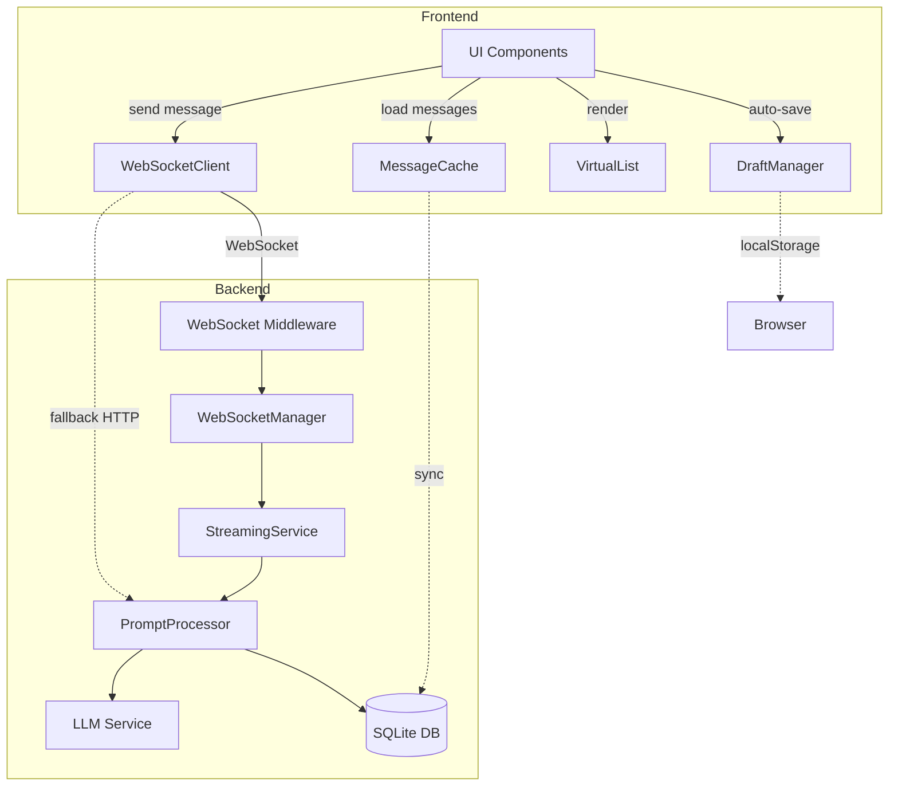

# Документ проектирования: Оптимизация производительности чата в реальном времени

## Обзор

Данный документ описывает проектирование системы оптимизации производительности для C# Refactoring Assistant. Система внедряет WebSocket для двунаправленной связи в реальном времени, потоковую передачу ответов LLM, кэширование сообщений в localStorage, виртуализацию списка сообщений и автосохранение черновиков. Все изменения интегрируются в существующую архитектуру ASP.NET Core 10 Minimal API и Vanilla JavaScript frontend с минимальными изменениями в текущем коде.

## Архитектура

### Текущая архитектура

**Backend:**
- ASP.NET Core 10 Minimal API
- Entity Framework Core 10 с SQLite
- HTTP REST endpoints для всех операций
- Polling для статуса выполнения задач (интервал 2 секунды)

**Frontend:**
- Vanilla JavaScript (ES6+)
- Прямые HTTP fetch запросы
- Оптимистичный UI (мгновенное отображение сообщений пользователя)
- Индикатор "печатает..." во время обработки

### Новая архитектура

**Backend:**
- Добавление WebSocket middleware в ASP.NET Core
- Новый `WebSocketManager` для управления соединениями
- Новый `StreamingService` для потоковой передачи ответов LLM
- Расширение `IPromptProcessor` для поддержки streaming
- Сохранение всех существующих HTTP endpoints (обратная совместимость)

**Frontend:**
- Новый `WebSocketClient` класс для управления WebSocket соединением
- Новый `MessageCache` класс для работы с localStorage
- Новый `VirtualList` класс для виртуализации списка сообщений
- Новый `DraftManager` класс для автосохранения черновиков
- Graceful degradation: автоматический fallback на HTTP при недоступности WebSocket

### Диаграмма компонентов



## Компоненты и интерфейсы

### Backend компоненты

#### 1. WebSocketManager

Управляет WebSocket соединениями и маршрутизацией сообщений.

```csharp
public interface IWebSocketManager
{
    // Регистрация нового WebSocket соединения
    Task RegisterConnectionAsync(
        string connectionId, 
        WebSocket webSocket, 
        int dialogueId);
    
    // Удаление соединения
    Task UnregisterConnectionAsync(string connectionId);
    
    // Отправка сообщения конкретному соединению
    Task SendMessageAsync(
        string connectionId, 
        WebSocketMessage message);
    
    // Отправка сообщения всем соединениям диалога
    Task BroadcastToDialogueAsync(
        int dialogueId, 
        WebSocketMessage message);
    
    // Получение соединения по ID
    WebSocket? GetConnection(string connectionId);
    
    // Проверка активности соединения
    bool IsConnectionActive(string connectionId);
}

public class WebSocketManager : IWebSocketManager
{
    // Словарь: connectionId -> (WebSocket, dialogueId)
    private readonly ConcurrentDictionary<string, (WebSocket, int)> _connections;
    
    // Словарь: dialogueId -> List<connectionId>
    private readonly ConcurrentDictionary<int, List<string>> _dialogueConnections;
    
    private readonly ILogger<WebSocketManager> _logger;
    
    // Реализация методов...
}
```

#### 2. StreamingService

Обрабатывает потоковую передачу ответов от LLM через WebSocket.

```csharp
public interface IStreamingService
{
    // Потоковая обработка промпта с отправкой фрагментов
    Task<string> ProcessPromptWithStreamingAsync(
        int dialogueId,
        string prompt,
        string connectionId,
        CancellationToken cancellationToken);
    
    // Отмена текущей генерации
    Task CancelGenerationAsync(string connectionId);
}

public class StreamingService : IStreamingService
{
    private readonly IPromptProcessor _promptProcessor;
    private readonly IWebSocketManager _webSocketManager;
    private readonly ILlmService _llmService;
    private readonly ILogger<StreamingService> _logger;
    
    // Словарь активных генераций: connectionId -> CancellationTokenSource
    private readonly ConcurrentDictionary<string, CancellationTokenSource> _activeGenerations;
    
    // Реализация методов...
}
```

#### 3. Расширение ILlmService для streaming

Добавление метода для потоковой генерации в существующий интерфейс.

```csharp
public interface ILlmService
{
    // Существующий метод
    Task<LlmResponse> SendPromptAsync(
        string prompt, 
        List<Message> conversationHistory,
        List<FunctionDefinition> availableFunctions);
    
    // Новый метод для streaming
    IAsyncEnumerable<string> StreamPromptAsync(
        string prompt,
        List<Message> conversationHistory,
        List<FunctionDefinition> availableFunctions,
        CancellationToken cancellationToken = default);
}
```

#### 4. WebSocket Middleware

Обработка WebSocket соединений в ASP.NET Core.

```csharp
public class WebSocketMiddleware
{
    private readonly RequestDelegate _next;
    private readonly IWebSocketManager _webSocketManager;
    private readonly IStreamingService _streamingService;
    private readonly ILogger<WebSocketMiddleware> _logger;
    
    public async Task InvokeAsync(HttpContext context)
    {
        // Проверка на WebSocket запрос
        if (context.WebSockets.IsWebSocketRequest)
        {
            await HandleWebSocketAsync(context);
        }
        else
        {
            await _next(context);
        }
    }
    
    private async Task HandleWebSocketAsync(HttpContext context)
    {
        // Извлечение dialogueId из query string
        // Принятие WebSocket соединения
        // Регистрация в WebSocketManager
        // Обработка входящих сообщений
        // Обработка отключения
    }
}
```

### Frontend компоненты

#### 1. WebSocketClient

Управляет WebSocket соединением с автоматическим переподключением.

```javascript
class WebSocketClient {
    constructor(dialogueId) {
        this.dialogueId = dialogueId;
        this.ws = null;
        this.connectionId = null;
        this.reconnectAttempts = 0;
        this.maxReconnectAttempts = 5;
        this.reconnectDelay = 1000; // Начальная задержка 1s
        this.isConnected = false;
        this.messageHandlers = new Map();
        this.onConnectionChange = null;
    }
    
    // Установка соединения
    async connect() { }
    
    // Отправка сообщения
    async sendMessage(type, payload) { }
    
    // Регистрация обработчика сообщений
    on(messageType, handler) { }
    
    // Отключение
    disconnect() { }
    
    // Переподключение с экспоненциальной задержкой
    async reconnect() { }
    
    // Fallback на HTTP
    async fallbackToHttp() { }
}
```

#### 2. MessageCache

Управляет кэшированием сообщений в localStorage.

```javascript
class MessageCache {
    constructor() {
        this.cachePrefix = 'msg_cache_';
        this.maxMessagesPerDialogue = 100;
        this.maxCacheSize = 5 * 1024 * 1024; // 5MB
        this.ttl = 24 * 60 * 60 * 1000; // 24 часа
    }
    
    // Получение кэшированных сообщений
    getCachedMessages(dialogueId) { }
    
    // Сохранение сообщений в кэш
    cacheMessages(dialogueId, messages) { }
    
    // Добавление одного сообщения
    addMessage(dialogueId, message) { }
    
    // Очистка устаревшего кэша
    cleanExpiredCache() { }
    
    // Проверка размера кэша
    checkCacheSize() { }
    
    // Удаление старых сообщений
    trimCache(dialogueId) { }
}
```

#### 3. VirtualList

Виртуализация списка сообщений для производительности.

```javascript
class VirtualList {
    constructor(containerElement, itemHeight) {
        this.container = containerElement;
        this.itemHeight = itemHeight;
        this.items = [];
        this.visibleRange = { start: 0, end: 0 };
        this.scrollTop = 0;
        this.viewportHeight = 0;
        this.bufferSize = 10; // Дополнительные элементы сверху/снизу
    }
    
    // Установка данных
    setItems(items) { }
    
    // Рендеринг видимых элементов
    render() { }
    
    // Обработка прокрутки
    handleScroll() { }
    
    // Вычисление видимого диапазона
    calculateVisibleRange() { }
    
    // Прокрутка к элементу
    scrollToItem(index) { }
    
    // Добавление нового элемента
    appendItem(item) { }
}
```

#### 4. DraftManager

Автосохранение черновиков сообщений с debouncing.

```javascript
class DraftManager {
    constructor() {
        this.draftPrefix = 'draft_';
        this.saveDelay = 2000; // 2 секунды
        this.saveTimeout = null;
        this.ttl = 7 * 24 * 60 * 60 * 1000; // 7 дней
    }
    
    // Сохранение черновика с debouncing
    saveDraft(dialogueId, content) { }
    
    // Немедленное сохранение
    saveDraftImmediate(dialogueId, content) { }
    
    // Загрузка черновика
    loadDraft(dialogueId) { }
    
    // Удаление черновика
    clearDraft(dialogueId) { }
    
    // Очистка устаревших черновиков
    cleanExpiredDrafts() { }
}
```

## Модели данных

### WebSocket сообщения

```csharp
// Базовое сообщение WebSocket
public class WebSocketMessage
{
    public string Type { get; set; } = string.Empty;
    public object? Payload { get; set; }
    public DateTime Timestamp { get; set; } = DateTime.UtcNow;
}

// Типы сообщений
public static class WebSocketMessageTypes
{
    public const string UserMessage = "user_message";
    public const string AssistantMessageStart = "assistant_message_start";
    public const string AssistantMessageChunk = "assistant_message_chunk";
    public const string AssistantMessageEnd = "assistant_message_end";
    public const string Error = "error";
    public const string CancelGeneration = "cancel_generation";
    public const string ConnectionAck = "connection_ack";
    public const string Ping = "ping";
    public const string Pong = "pong";
}

// Payload для фрагмента сообщения
public class MessageChunkPayload
{
    public int DialogueId { get; set; }
    public int? MessageId { get; set; }
    public string Content { get; set; } = string.Empty;
    public bool IsComplete { get; set; }
}
```

### Кэш сообщений (localStorage)

```javascript
// Структура кэша в localStorage
{
    "msg_cache_1": {
        "dialogueId": 1,
        "messages": [
            {
                "id": 1,
                "role": "user",
                "content": "...",
                "timestamp": "2024-01-01T00:00:00Z"
            }
        ],
        "lastUpdated": "2024-01-01T00:00:00Z",
        "version": 1
    }
}
```

### Черновики (localStorage)

```javascript
// Структура черновика в localStorage
{
    "draft_1": {
        "dialogueId": 1,
        "content": "...",
        "savedAt": "2024-01-01T00:00:00Z"
    }
}
```

## Свойства корректности

*Свойство корректности - это характеристика или поведение, которое должно выполняться для всех допустимых выполнений системы. Свойства служат мостом между человекочитаемыми спецификациями и машинно-проверяемыми гарантиями корректности.*


### Рефлексия свойств

После анализа всех критериев приемки выявлены следующие возможности для объединения избыточных свойств:

**Группа 1: Производительность отображения**
- Свойства 1.5 (отображение WebSocket сообщений за 100ms) и 2.2 (добавление фрагментов за 50ms) можно объединить в одно свойство о производительности отображения сообщений
- Свойство 3.2 (отображение кэша за 100ms) также относится к этой группе

**Группа 2: Сохранение в localStorage**
- Свойства 3.1 (сохранение новых сообщений) и 3.4 (обновление кэша при изменениях) можно объединить в одно свойство о синхронизации кэша
- Свойства 3.6 и 3.7 (очистка по времени и размеру) можно объединить в одно свойство об управлении размером кэша

**Группа 3: Логирование**
- Свойства 7.1, 7.4 и 7.6 (логирование различных событий) можно объединить в одно свойство о полноте логирования

**Группа 4: Виртуализация и прокрутка**
- Свойства 4.5 и 4.6 (автоматическая прокрутка) можно объединить в одно свойство о поведении прокрутки

После рефлексии оставляем только уникальные свойства, которые проверяют различные аспекты системы.

### Свойства корректности

#### Свойство 1: Экспоненциальная задержка переподключения

*Для любого* разрыва WebSocket соединения, последовательность задержек переподключения должна следовать экспоненциальной прогрессии (1s, 2s, 4s, 8s) с максимумом 30s.

**Validates: Requirements 1.2**

#### Свойство 2: Передача сообщений через WebSocket

*Для любого* сообщения пользователя, если WebSocket соединение активно, то сообщение должно быть передано через WebSocket, а не через HTTP API.

**Validates: Requirements 1.4**

#### Свойство 3: Производительность отображения сообщений

*Для любого* сообщения, полученного через WebSocket или streaming фрагмента, время от получения до отображения в UI не должно превышать 100ms.

**Validates: Requirements 1.5, 2.2**

#### Свойство 4: Синхронизация пропущенных сообщений

*Для любого* восстановления WebSocket соединения после разрыва, все сообщения, созданные во время разрыва, должны быть синхронизированы с сервером и отображены в правильном порядке.

**Validates: Requirements 1.6**

#### Свойство 5: Создание пустого сообщения при streaming

*Для любого* начала генерации ответа LLM, в интерфейсе должно быть создано пустое сообщение ассистента до получения первого фрагмента.

**Validates: Requirements 2.1**

#### Свойство 6: Отмена генерации

*Для любого* активного процесса генерации ответа, нажатие кнопки "Остановить генерацию" должно отправить команду отмены на сервер и прекратить обновление сообщения в течение 1 секунды.

**Validates: Requirements 2.3**

#### Свойство 7: Сохранение завершенного ответа

*Для любого* завершенного процесса генерации ответа, полное сообщение должно быть сохранено в базе данных с корректным dialogueId и timestamp.

**Validates: Requirements 2.4**

#### Свойство 8: Обработка ошибок streaming

*Для любой* ошибки во время потоковой передачи, система должна отобразить частичный ответ (если есть) и сообщение об ошибке, не теряя уже полученные данные.

**Validates: Requirements 2.5**

#### Свойство 9: Восстановление streaming после разрыва

*Для любого* прерывания соединения во время streaming, полученная часть ответа должна быть сохранена, и после переподключения система должна попытаться возобновить передачу или запросить полный ответ.

**Validates: Requirements 2.6**

#### Свойство 10: Синхронизация кэша с новыми сообщениями

*Для любого* нового сообщения в диалоге, оно должно быть немедленно добавлено в localStorage кэш для этого диалога с корректной временной меткой.

**Validates: Requirements 3.1**

#### Свойство 11: Быстрое отображение кэшированных сообщений

*Для любого* переключения на диалог с кэшированными сообщениями, они должны быть отображены из localStorage в течение 100ms, до завершения запроса к серверу.

**Validates: Requirements 3.2**

#### Свойство 12: Фоновая синхронизация кэша

*Для любого* отображения кэшированных сообщений, система должна запустить фоновый запрос к серверу для получения обновлений, не блокируя UI.

**Validates: Requirements 3.3**

#### Свойство 13: Обновление кэша только при изменениях

*Для любого* ответа сервера с обновленными сообщениями, кэш и интерфейс должны обновляться только если есть реальные изменения (новые сообщения или измененный контент).

**Validates: Requirements 3.4**

#### Свойство 14: Ограничение размера кэша по количеству

*Для любого* диалога, кэш в localStorage должен содержать не более 100 последних сообщений, автоматически удаляя самые старые при превышении лимита.

**Validates: Requirements 3.5**

#### Свойство 15: Управление размером кэша

*Для любого* состояния кэша, если общий размер превышает 5MB, система должна удалить самые старые сообщения до достижения 4MB, а сообщения старше 24 часов должны удаляться при очистке.

**Validates: Requirements 3.6, 3.7**

#### Свойство 16: Виртуализация больших списков

*Для любого* диалога с более чем 50 сообщениями, в DOM должны быть отрендерены только сообщения в видимой области viewport плюс буфер в 10 сообщений сверху и снизу.

**Validates: Requirements 4.1**

#### Свойство 17: Производительность прокрутки

*Для любой* прокрутки списка сообщений, система должна поддерживать частоту обновления не менее 60 FPS, динамически добавляя и удаляя DOM элементы.

**Validates: Requirements 4.2**

#### Свойство 18: Подгрузка истории при прокрутке

*Для любой* прокрутки к началу диалога, когда пользователь достигает порога в 20 сообщений от начала, система должна автоматически загрузить предыдущие сообщения с сервера.

**Validates: Requirements 4.3**

#### Свойство 19: Поиск по всем сообщениям

*Для любого* поискового запроса, система должна найти совпадения во всех сообщениях диалога (включая не отрендеренные в данный момент) и прокрутить к первому результату.

**Validates: Requirements 4.4**

#### Свойство 20: Автоматическая прокрутка к новым сообщениям

*Для любого* нового сообщения, добавленного в конец диалога, если пользователь находился в пределах 100px от конца списка, система должна автоматически прокрутить к новому сообщению.

**Validates: Requirements 4.6**

#### Свойство 21: Debouncing автосохранения черновиков

*Для любой* последовательности ввода текста в поле ввода, черновик должен быть сохранен в localStorage ровно через 2 секунды после последнего нажатия клавиши, без промежуточных сохранений.

**Validates: Requirements 5.1**

#### Свойство 22: Переключение черновиков между диалогами

*Для любого* переключения между диалогами, текущий черновик должен быть немедленно сохранен, а черновик нового диалога должен быть загружен в поле ввода.

**Validates: Requirements 5.2**

#### Свойство 23: Восстановление черновика после перезагрузки

*Для любого* черновика, сохраненного в localStorage, после перезагрузки страницы он должен быть восстановлен в поле ввода для соответствующего диалога.

**Validates: Requirements 5.3**

#### Свойство 24: Удаление черновика после отправки

*Для любого* отправленного сообщения, черновик для текущего диалога должен быть немедленно удален из localStorage.

**Validates: Requirements 5.4**

#### Свойство 25: Очистка устаревших черновиков

*Для любого* черновика, не изменявшегося более 7 дней, он должен быть удален при следующей операции очистки.

**Validates: Requirements 5.5**

#### Свойство 26: Предотвращение пустых черновиков

*Для любого* состояния поля ввода, если оно содержит только пробельные символы или пусто, черновик не должен создаваться в localStorage.

**Validates: Requirements 5.6**

#### Свойство 27: Fallback на HTTP при недоступности WebSocket

*Для любой* ситуации, когда WebSocket соединение недоступно (после 5 неудачных попыток переподключения), система должна автоматически переключиться на HTTP API для отправки и получения сообщений.

**Validates: Requirements 6.1**

#### Свойство 28: Fallback для streaming

*Для любой* ситуации, когда потоковая передача недоступна, система должна отображать индикатор загрузки и показывать полный ответ после завершения генерации.

**Validates: Requirements 6.2**

#### Свойство 29: Отображение статуса соединения

*Для любого* режима работы (WebSocket или HTTP), в интерфейсе должен отображаться текущий статус соединения с соответствующей иконкой.

**Validates: Requirements 6.5**

#### Свойство 30: Полнота логирования

*Для любого* значимого события (установка/разрыв соединения, операции с кэшем, ошибки), система должна записать лог с временной меткой и контекстной информацией в консоль браузера.

**Validates: Requirements 7.1, 7.4, 7.6**

#### Свойство 31: Измерение TTFB для streaming

*Для любого* процесса потоковой передачи ответа, система должна измерить и залогировать время получения первого фрагмента (Time To First Byte).

**Validates: Requirements 7.2**

#### Свойство 32: Мониторинг производительности прокрутки

*Для любой* операции виртуализации списка, система должна измерять FPS прокрутки и логировать предупреждение, если FPS падает ниже 30.

**Validates: Requirements 7.3**

## Обработка ошибок

### Стратегия обработки ошибок

**Принципы:**
1. Graceful degradation - система продолжает работать с ограниченной функциональностью
2. Информативные сообщения об ошибках для пользователя
3. Детальное логирование для отладки
4. Автоматическое восстановление где возможно

### Сценарии ошибок

#### 1. Ошибки WebSocket соединения

**Проблема:** Невозможно установить или поддерживать WebSocket соединение

**Обработка:**
- Автоматическое переподключение с экспоненциальной задержкой (до 5 попыток)
- После 5 неудачных попыток - переключение на HTTP режим
- Отображение статуса соединения в UI
- Логирование причины разрыва

**Код (Frontend):**
```javascript
async reconnect() {
    if (this.reconnectAttempts >= this.maxReconnectAttempts) {
        console.warn('Max reconnect attempts reached, falling back to HTTP');
        await this.fallbackToHttp();
        return;
    }
    
    const delay = Math.min(
        this.reconnectDelay * Math.pow(2, this.reconnectAttempts),
        30000
    );
    
    console.log(`Reconnecting in ${delay}ms (attempt ${this.reconnectAttempts + 1})`);
    
    await new Promise(resolve => setTimeout(resolve, delay));
    this.reconnectAttempts++;
    await this.connect();
}
```

#### 2. Ошибки потоковой передачи

**Проблема:** Прерывание streaming во время генерации ответа

**Обработка:**
- Сохранение полученной части ответа
- Отображение частичного ответа с индикатором ошибки
- Попытка возобновления после переподключения
- Возможность повторной отправки запроса

**Код (Backend):**
```csharp
public async Task<string> ProcessPromptWithStreamingAsync(
    int dialogueId,
    string prompt,
    string connectionId,
    CancellationToken cancellationToken)
{
    var fullResponse = new StringBuilder();
    
    try
    {
        await foreach (var chunk in _llmService.StreamPromptAsync(
            prompt, history, functions, cancellationToken))
        {
            fullResponse.Append(chunk);
            
            await _webSocketManager.SendMessageAsync(connectionId, new WebSocketMessage
            {
                Type = WebSocketMessageTypes.AssistantMessageChunk,
                Payload = new MessageChunkPayload
                {
                    DialogueId = dialogueId,
                    Content = chunk,
                    IsComplete = false
                }
            });
        }
        
        // Отправка финального сообщения
        await _webSocketManager.SendMessageAsync(connectionId, new WebSocketMessage
        {
            Type = WebSocketMessageTypes.AssistantMessageEnd,
            Payload = new MessageChunkPayload
            {
                DialogueId = dialogueId,
                Content = fullResponse.ToString(),
                IsComplete = true
            }
        });
        
        return fullResponse.ToString();
    }
    catch (OperationCanceledException)
    {
        _logger.LogInformation("Streaming cancelled by user for dialogue {DialogueId}", dialogueId);
        return fullResponse.ToString(); // Возвращаем частичный ответ
    }
    catch (Exception ex)
    {
        _logger.LogError(ex, "Error during streaming for dialogue {DialogueId}", dialogueId);
        
        // Отправка сообщения об ошибке
        await _webSocketManager.SendMessageAsync(connectionId, new WebSocketMessage
        {
            Type = WebSocketMessageTypes.Error,
            Payload = new { 
                message = "Ошибка генерации ответа",
                partialResponse = fullResponse.ToString()
            }
        });
        
        throw;
    }
}
```

#### 3. Ошибки localStorage

**Проблема:** localStorage недоступен (приватный режим, квота превышена)

**Обработка:**
- Проверка доступности при инициализации
- Отключение кэширования и автосохранения черновиков
- Работа в режиме "только память"
- Уведомление пользователя о ограниченной функциональности

**Код (Frontend):**
```javascript
class MessageCache {
    constructor() {
        this.isAvailable = this.checkLocalStorageAvailability();
        if (!this.isAvailable) {
            console.warn('localStorage unavailable, caching disabled');
        }
    }
    
    checkLocalStorageAvailability() {
        try {
            const test = '__localStorage_test__';
            localStorage.setItem(test, test);
            localStorage.removeItem(test);
            return true;
        } catch (e) {
            return false;
        }
    }
    
    cacheMessages(dialogueId, messages) {
        if (!this.isAvailable) {
            return; // Тихо игнорируем, если недоступно
        }
        
        try {
            const key = this.cachePrefix + dialogueId;
            const data = {
                dialogueId,
                messages,
                lastUpdated: new Date().toISOString(),
                version: 1
            };
            localStorage.setItem(key, JSON.stringify(data));
        } catch (e) {
            if (e.name === 'QuotaExceededError') {
                console.warn('localStorage quota exceeded, cleaning cache');
                this.cleanExpiredCache();
                // Повторная попытка после очистки
                try {
                    localStorage.setItem(key, JSON.stringify(data));
                } catch (e2) {
                    console.error('Failed to cache messages after cleanup', e2);
                }
            } else {
                console.error('Error caching messages', e);
            }
        }
    }
}
```

#### 4. Ошибки виртуализации

**Проблема:** Браузер не поддерживает необходимые API

**Обработка:**
- Проверка поддержки IntersectionObserver и ResizeObserver
- Fallback на полный рендеринг с предупреждением
- Ограничение количества отображаемых сообщений (например, 500)

**Код (Frontend):**
```javascript
class VirtualList {
    constructor(containerElement, itemHeight) {
        this.isSupported = this.checkSupport();
        
        if (!this.isSupported) {
            console.warn('Virtualization not supported, using full rendering');
            this.showPerformanceWarning();
        }
        
        // Инициализация...
    }
    
    checkSupport() {
        return 'IntersectionObserver' in window && 
               'ResizeObserver' in window;
    }
    
    showPerformanceWarning() {
        if (this.items.length > 500) {
            const warning = document.createElement('div');
            warning.className = 'performance-warning';
            warning.textContent = 
                'Внимание: большое количество сообщений может снизить производительность';
            this.container.insertBefore(warning, this.container.firstChild);
        }
    }
}
```

#### 5. Ошибки сети

**Проблема:** Временные проблемы с сетью, таймауты

**Обработка:**
- Retry логика с экспоненциальной задержкой
- Кэширование запросов для повторной отправки
- Индикация проблем с сетью в UI
- Сохранение несохраненных данных локально

**Код (Frontend):**
```javascript
async function fetchWithRetry(url, options, maxRetries = 3) {
    let lastError;
    
    for (let i = 0; i < maxRetries; i++) {
        try {
            const response = await fetch(url, {
                ...options,
                signal: AbortSignal.timeout(10000) // 10s timeout
            });
            
            if (!response.ok) {
                throw new Error(`HTTP ${response.status}: ${response.statusText}`);
            }
            
            return response;
        } catch (error) {
            lastError = error;
            
            if (i < maxRetries - 1) {
                const delay = Math.pow(2, i) * 1000;
                console.log(`Request failed, retrying in ${delay}ms...`);
                await new Promise(resolve => setTimeout(resolve, delay));
            }
        }
    }
    
    throw new Error(`Request failed after ${maxRetries} attempts: ${lastError.message}`);
}
```

## Стратегия тестирования

### Двойной подход к тестированию

Система требует комбинации unit-тестов и property-based тестов для полного покрытия:

**Unit-тесты:**
- Конкретные примеры и edge cases
- Интеграционные точки между компонентами
- Условия ошибок и граничные значения
- Примеры: подключение WebSocket при загрузке страницы, fallback на HTTP после 5 попыток

**Property-based тесты:**
- Универсальные свойства для всех входных данных
- Комплексное покрытие через рандомизацию
- Проверка инвариантов системы
- Минимум 100 итераций на тест

### Конфигурация property-based тестов

**Backend (C#):**
- Библиотека: FsCheck или CsCheck
- Минимум 100 итераций на свойство
- Теги в комментариях: `// Feature: real-time-chat-optimization, Property N: [текст свойства]`

**Frontend (JavaScript):**
- Библиотека: fast-check
- Минимум 100 итераций на свойство
- Теги в комментариях: `// Feature: real-time-chat-optimization, Property N: [текст свойства]`

### Примеры тестов

#### Property-based тест: Экспоненциальная задержка переподключения

```javascript
// Feature: real-time-chat-optimization, Property 1: Экспоненциальная задержка переподключения
describe('WebSocket reconnection delays', () => {
    it('should follow exponential backoff pattern', () => {
        fc.assert(
            fc.property(
                fc.integer({ min: 0, max: 10 }), // Количество попыток
                (attemptNumber) => {
                    const client = new WebSocketClient(1);
                    const expectedDelay = Math.min(
                        1000 * Math.pow(2, attemptNumber),
                        30000
                    );
                    
                    const actualDelay = client.calculateReconnectDelay(attemptNumber);
                    
                    return actualDelay === expectedDelay;
                }
            ),
            { numRuns: 100 }
        );
    });
});
```

#### Property-based тест: Ограничение размера кэша

```javascript
// Feature: real-time-chat-optimization, Property 14: Ограничение размера кэша по количеству
describe('Message cache size limits', () => {
    it('should never exceed 100 messages per dialogue', () => {
        fc.assert(
            fc.property(
                fc.integer({ min: 1, max: 5 }), // dialogueId
                fc.array(fc.record({
                    id: fc.integer(),
                    role: fc.constantFrom('user', 'assistant'),
                    content: fc.string({ minLength: 1, maxLength: 100 }),
                    timestamp: fc.date()
                }), { minLength: 50, maxLength: 200 }), // Массив сообщений
                (dialogueId, messages) => {
                    const cache = new MessageCache();
                    cache.cacheMessages(dialogueId, messages);
                    
                    const cached = cache.getCachedMessages(dialogueId);
                    
                    return cached.length <= 100;
                }
            ),
            { numRuns: 100 }
        );
    });
});
```

#### Unit-тест: Fallback на HTTP после 5 попыток

```javascript
describe('WebSocket fallback behavior', () => {
    it('should fallback to HTTP after 5 failed reconnection attempts', async () => {
        const client = new WebSocketClient(1);
        
        // Мокируем WebSocket для симуляции неудачных подключений
        global.WebSocket = jest.fn(() => ({
            addEventListener: jest.fn(),
            close: jest.fn(),
            readyState: WebSocket.CLOSED
        }));
        
        // Пытаемся подключиться 5 раз
        for (let i = 0; i < 5; i++) {
            await client.connect();
        }
        
        // Проверяем, что клиент переключился на HTTP режим
        expect(client.isUsingHttp).toBe(true);
        expect(client.isConnected).toBe(false);
    });
});
```

#### Property-based тест (Backend): Сохранение завершенного ответа

```csharp
// Feature: real-time-chat-optimization, Property 7: Сохранение завершенного ответа
[Property]
public async Task CompletedResponsesShouldBeSavedToDatabase(
    PositiveInt dialogueId,
    NonEmptyString prompt,
    NonEmptyString response)
{
    // Arrange
    var dbContext = CreateInMemoryDbContext();
    var streamingService = CreateStreamingService(dbContext);
    
    // Act
    await streamingService.ProcessPromptWithStreamingAsync(
        dialogueId.Get,
        prompt.Get,
        "test-connection-id",
        CancellationToken.None);
    
    // Assert
    var savedMessage = await dbContext.Messages
        .FirstOrDefaultAsync(m => 
            m.DialogueId == dialogueId.Get && 
            m.Role == "assistant");
    
    Assert.NotNull(savedMessage);
    Assert.Equal(response.Get, savedMessage.Content);
    Assert.True(savedMessage.Timestamp <= DateTime.UtcNow);
}
```

### Тестирование производительности

**Метрики для мониторинга:**
- Время отображения сообщений (< 100ms)
- Время добавления фрагментов streaming (< 50ms)
- FPS при прокрутке (>= 60)
- Время загрузки кэшированных сообщений (< 100ms)
- TTFB для streaming ответов

**Инструменты:**
- Performance API браузера
- Chrome DevTools Performance profiler
- Автоматические performance тесты в CI/CD

```javascript
// Пример performance теста
describe('Message display performance', () => {
    it('should display messages within 100ms', async () => {
        const messages = generateRandomMessages(50);
        
        const startTime = performance.now();
        await displayMessages(messages);
        const endTime = performance.now();
        
        const duration = endTime - startTime;
        expect(duration).toBeLessThan(100);
    });
});
```

### Интеграционное тестирование

**Сценарии:**
1. Полный цикл: отправка сообщения → streaming → сохранение → кэширование
2. Разрыв соединения → переподключение → синхронизация
3. Переключение диалогов → загрузка кэша → фоновая синхронизация
4. Fallback: WebSocket недоступен → HTTP режим → возврат к WebSocket

**Пример интеграционного теста:**
```javascript
describe('Full message lifecycle', () => {
    it('should handle complete message flow with caching', async () => {
        // 1. Установка WebSocket соединения
        const client = new WebSocketClient(1);
        await client.connect();
        expect(client.isConnected).toBe(true);
        
        // 2. Отправка сообщения
        const message = 'Test refactoring command';
        await client.sendMessage('user_message', { content: message });
        
        // 3. Получение streaming ответа
        const chunks = [];
        client.on('assistant_message_chunk', (chunk) => {
            chunks.push(chunk.content);
        });
        
        await waitForStreamingComplete();
        
        // 4. Проверка кэширования
        const cache = new MessageCache();
        const cachedMessages = cache.getCachedMessages(1);
        
        expect(cachedMessages).toContainEqual(
            expect.objectContaining({
                role: 'user',
                content: message
            })
        );
        
        expect(cachedMessages).toContainEqual(
            expect.objectContaining({
                role: 'assistant',
                content: chunks.join('')
            })
        );
    });
});
```
